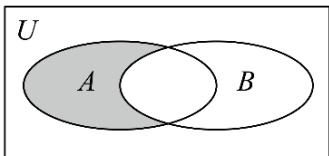
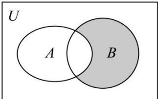

## 题型04 韦恩图及其应用

【典例1】已知全集 $U=\left\{-2,-1,0,1,2,3,4\right\}$ ，集合 $A=\left\{x\in\mathbb{Z}\mid x^{2}-x<6\right\}$ ， $B=\left\{-2,0,1,3\right\}$ ，给出下列4种方式表示图中阴影部分：① $\left\{-1,2\right\}$ ② $\check{\mathfrak{Q}}_{(A\cup B)}B$ ③ $A\cap(\check{\mathfrak{Q}}_{U}B)$ ④ $(\check{\mathfrak{Q}}_{U}A)\cap(\check{\mathfrak{Q}}_{U}B)$ ，正确的有几个？（）

A.1个 B.2个 C.3个 D.4个

【答案】C

【详解】由图可知阴影部分所表示的集合为 $\breve{\partial}_{(A\cup B)}B,\quad A\cap(\breve{\partial}_{U}B)$ ，故②③正确；

因为 $A = \{x\in Z| - 2 <   x <   3\} = \{-1,0,1,2\}$ ， $\check{\mathbf{Q}}_U B = \{-1,2,4\}$

所以 $A \cap (\tilde{\partial}_{U} B) = \{-1, 2\}$ ，故①正确；

$\left(\check{\mathfrak{Q}}_{U}A\right)\cap\left(\check{\mathfrak{Q}}_{U}B\right)=\left\{4\right\}$ ，故④错误.

所以正确的有 3 个.

故选：C.

【典例2】如图，已知矩形 $U$ 表示全集， $A, B$ 是 $U$ 的两个子集，若 $U = \{x \in \mathbf{Z} \| x - 2| + |x + 2| = 4\}$ ，集合 $A = \{\text{快} x^2 - x = 0\}$ ， $B = \{\text{快} x + a = 0, a \in A\}$ ，则图中阴影部分所表示的集合为（）

A. $\{-2, -1, 2\}$ B. $\{-2, -1, 0, 1, 2\}$ C. $\{-1, -2\}$ D. $\{-1\}$

【答案】D

【详解】对于方程 $|x - 2| + |x + 2| = 4$

当 $x = 2$ 时， $x - 2 + x + 2 = 4$ ，解得 $x = 2$

当 $-2 < x < 2$ 时， $2 - x + x + 2 = 4$ ，即 $4 = 4$ ，恒成立，

当 $x \leq -2$ 时， $2 - x - (x + 2) = 4$ ，解得 $x = -2$

$U = \{x\in \mathbf{Z}\mid -2\leq x\leq 2\}$

由题意得， $A=\left\{0,1\right\}$ ， $B=\left\{\mid x,x=-a,a\in A\right\}=\left\{0,-1\right\}$

图中阴影部分表示在集合 $B$ 中不在集合 $A$ 中的元素构成的集合，为 $\{-1\}$

故选：D.

## 方法技巧

韦恩(Venn)图能更直观地表示集合之间的关系，先分析集合关系，化简集合，再由韦恩(Venn)图所表示的集合关系进行运算．对复杂的集合关系问题，或相关的数学应用问题，可通过构造韦恩(Venn)图进行求解．

![[高中/课堂同步/题库/人教A版高中数学同步讲义(2026)/01_必修第一册/第一章 集合与常用逻辑用语/讲义/第一章_集合与常用逻辑用语_高效培优讲义_/题型04_韦恩图及其应用_sec_23/questions/Q00067822.md]]
![[高中/课堂同步/题库/人教A版高中数学同步讲义(2026)/01_必修第一册/第一章 集合与常用逻辑用语/讲义/第一章_集合与常用逻辑用语_高效培优讲义_/题型04_韦恩图及其应用_sec_23/questions/Q00067823.md]]
![[高中/课堂同步/题库/人教A版高中数学同步讲义(2026)/01_必修第一册/第一章 集合与常用逻辑用语/讲义/第一章_集合与常用逻辑用语_高效培优讲义_/题型04_韦恩图及其应用_sec_23/questions/Q00067824.md]]
