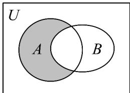

> [!faq]- 《第一章_集合与常用逻辑用语_高效培优单元测试_强化卷_》官方解析
>
> > [!success]- **【答案】**  A. $\{x\mid x\quad 1\}$ B. $\{x\mid x\leq 1\}$ C. $\{x\mid 0 < x\leq 1\}$ D. $\{x\mid 1\leq x < 2\}$
>
> > [!note]- **【分析】**
> > 根据Venn图可得阴影部分表示的集合为 $A\cap(\breve{\partial}_{U}B)$ ，利用补集运算求出 $\breve{\partial}_{U}B$ ，由交集运算求出 $A\cap(\breve{\partial}_{U}B)$
>
> > [!note]- **【解析】**
> > 由Venn图知所求阴影部分的集合为 $A\cap(\breve{\partial}_{U}B)$
> >
> > $$
> > \because B = \{x \mid x <   1 \} \quad \therefore \check {\mathfrak {Q}} _ {U} B = \{x \mid x \quad 1 \}
> > $$
> >
> > 又 $A = \{x\mid 0 <   x <   2\}$
> >
> > $$
> > \therefore A \cap \left(\check {\mathfrak {Q}} _ {U} B\right) = \left\{x \mid 1 \leq x <   2 \right\}
> > $$
> >
> > 故选 **D**.
