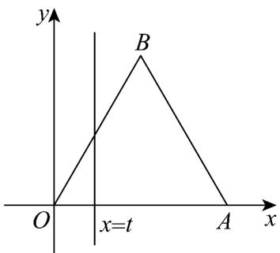

<!-- question-source:start -->
30. 如图， $\triangle OAB$ 是边长为 2 的正三角形，记 $\triangle OAB$ 位于直线 $x = t(t < 2)$ 右侧的图形的面积为函数 $f(t)$

(1)求 $f(t)$ 的解析式；

(2)已知 $m \in (0,2)$ 时， $f(m) = \frac{\sqrt{3}}{2}$ 。若正实数 $a, b$ 满足 $2a + b = m$ ，求 $\frac{b}{a} + \frac{1}{b}$ 的最小值。
<!-- question-source:end -->

![[高中/课堂同步/题库/人教A版高中数学同步讲义(2026)/01_必修第一册/第三章 函数的概念与性质/专项训练/专题01_函数的概念及其表示的四大常考题型_高效培优专项训练_/题型三_sec_04/questions/answers/Q00067879A1.md]]
