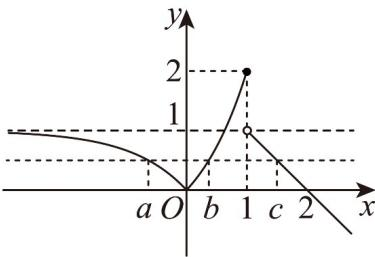

> [!faq]- 《专题01_函数的概念及其表示的四大常考题型_高效培优专项训练_》官方解析
>
> > [!success]- **【答案】** C
>
> > [!note]- **【解析】**
> > 如图所示：
> >
> > 
> >
> > 因为 $a < b < c$ 且 $f(a) = f(b) = f(c)$
> >
> > 从图像可得 $a \in (-\infty, 0)$ , $b \in (0, 1)$ , $c \in (1, 2)$ ,
> >
> > 因为 $f(a) = f(b)$ ，所以 $1 - 3^{a} = 3^{b} - 1$ ，即 $3^{a} + 3^{b} = 2$
> >
> > 因为 $c \in (1,2)$ ，所以 $3^c \in (3,9)$
> >
> > 则 $3^{a} + 3^{b} + 3^{c} = 2 + 3^{c}\in (5,11)$
> >
> > 所以 $3^{a} + 3^{b} + 3^{c}$ 的取值范围为 $(5,11)$
> >
> > 故选：C.
> >
> > 22. 如果函数 $f(x) = \begin{cases} x - 4, & x = 2024, \\ f(f(x + 9)), & x < 2024, \end{cases}$ 那么 $f(10) = (\quad)$ A. 2020 B. 2021 C. 2023 D. 2025
> >
> > 【答案】B
> >
> > 【详解】记 $f^{n+1}(x)=f^{n}(f(x))$ ， $f^{1}(x)=f(x)$ ，
> >
> > 根据 $f(x)=\left\{\begin{aligned}x-4,x&2024,\\ f(f(x+9)),&x<2024,\end{aligned}\right.$ 可得， $f(10)=f^{2}(19)=f^{3}(28)=\cdots=f^{224}(2017)=f^{225}(2026)$ ，
> >
> > 而 $f(2026)=2022,f(2022)=f(f(2031))=f(2027)=2023$ ， $f(2023)=f(f(2032))=f(2028)=2024$ ， $f(2024)=2020$ ， $f(2020)=f(f(2029))=f(2025)=2021$ ， $f(2021)=f(f(2030))=f(2026)=2022$ ， $f^{5}(2022)=f^{4}(2023)=f^{3}(2024)=f^{2}(2020)=f(2021)=2022$ 所以 $f^{n}(2022)$ 的周期为 5，取值分别为 2023，2024，2020，2021，2022， $f^{225}(2026)=f^{224}(2022)=f^{4}(2022)=2021.$
> >
> > 故选 **B**
