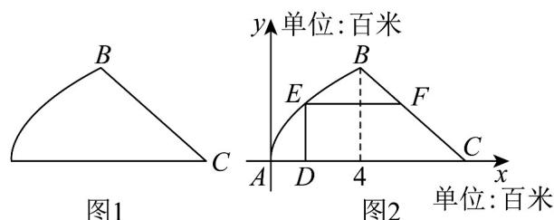

> [!faq]- 《专题01_函数的概念及其表示的四大常考题型_高效培优专项训练_》官方解析
>
> > [!success]- **【答案】** (1) $\left[0,+\infty\right)$ (2) $\left[-\frac{37}{12}, +\infty\right)$ (3) $\left(-\infty, -3\right]$ 
>
> > [!note]- **【解析】**
> > （1）因为 x > 1，则 x - 1 > 0，
> >
> > 可得 $y = \frac{x^2 - 4x + 4}{x - 1} = (x - 1) + \frac{1}{x - 1} - 2 \quad 2\sqrt{(x - 1) \cdot \frac{1}{x - 1}} - 2 = 0$ ，
> >
> > 当且仅当 $x - 1 = \frac{1}{x - 1}$ ，即 $x = 2$ 时，等号成立，
> >
> > 所以函数的值域为 $\left[0,+\infty\right)$ .
> >
> > (2) 令 $t = \sqrt{x + 1} \quad 0$ ，则 $x = t^2 - 1$ ，
> >
> > 可得 $y = 3\left(t^2 - 1\right) - t = 3t^2 - t - 3 = 3\left(t - \frac{1}{6}\right)^2 - \frac{37}{12} - \frac{37}{12}$ ，
> >
> > 当 $t = \frac{1}{6}$ 时，等号成立，
> >
> > 所以函数的值域为 $\left[-\frac{37}{12}, +\infty\right)$ .
> >
> > (3) 因为 $x < \frac{2}{3}$ ，则 2 - 3x > 0，
> >
> > 可得 $-f(x) = -\left(3x + 1 + \frac{9}{3x - 2}\right) = (2 - 3x) + \frac{9}{2 - 3x} - 3$ $2\sqrt{(2 - 3x)\cdot\frac{9}{2 - 3x}} -3 = 3$
> >
> > 当且仅当 $2 - 3x = \frac{9}{2 - 3x}$ ，即 $x = -\frac{1}{3}$ 时，等号成立，
> >
> > 即 $f(x) \leq -3$ ，所以函数的值域为 $(- \infty, -3]$ .
