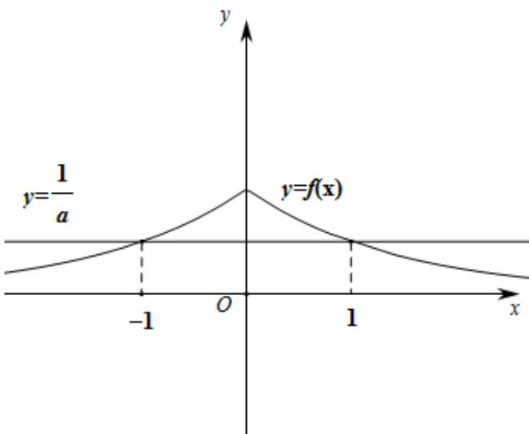

> [!faq]- 《专题02_函数的基本性质的四大常考题型_高效培优专项训练_》官方解析
>
> > [!success]- **【答案】** A. $(- \infty, 0)$ B. $(-a, +\infty)$ C. $(- \infty, -1)$ D. $(1, +\infty)$
>
> > [!note]- **【解析】**
> > 令 $f(x) = a^{-|x|} = \frac{1}{a}$ ，解得 $x = \pm 1$ ，
> >
> > 在同一直角坐标系中作出 $y = f(x)$ 与 $y = \frac{1}{a}$ 的图象，如图，
> >
> > 
> >
> > 所以 $f_{k}(x)=\left\{\begin{aligned}&a^{-|x|},&x\leq-1\\&\frac{1}{a},&-1<x<1\\&a^{-|x|},&x\quad1\end{aligned}\right.$ ，所以函数 的单调减区间为 $f_{k}(x)\quad(1,+\infty)$
> >
> > 故选：D.
> >
> > 3. 判断下列选项中正确的是（ ）A．函数 $y = \frac{1}{x}$ 的单调递减区间是 $(-∞,0)∪(0,+∞)$ B．若对于区间I上的函数 $f(x)$ ，满足对于任意的 $x_1$ ， $x_2∈I$ ， $\frac{f(x_1) - f(x_2)}{x_2 - x_1} > 0$ ，则函数 $f(x)$ 在I上是增函数
> >
> > C．已知 $x≠0$ 时， $f(x)=x-\frac{1}{x}$ ，则 $f\left(-\frac{1}{x}\right)=-x+\frac{1}{x}$ D．已知 $f(x+1)=x^2+2x+2$ ，则 $f(x)=x^2+1$ ．
> >
> > 【答案】D
> >
> > 【详解】取 $x_{1} = -1 < x_{2} = 1$ ，则 $f(-1) = -1 < f(1) = 1$ ，所以函数 $y = \frac{1}{x}$ 单调递减区间是 $(-\infty,0) \cup (0, +\infty)$ 错误，故A错误；由 $\frac{f(x_1) - f(x_2)}{x_2 - x_1} > 0$ 可得 $\frac{f(x_1) - f(x_2)}{x_1 - x_2} < 0$ ，由函数的单调性定义知函数为减函数，故B错误；由 $f(x) = x - \frac{1}{x}$ 可得 $f\left(-\frac{1}{x}\right) = x - \frac{1}{x}$ ，故C错误；因为 $f(x + 1) = x^2 + 2x + 2 = (x + 1)^2 + 1$ ，所以 $f(x) = x^2 + 1$ ，故D正确。
> >
> > 故选 **D**
