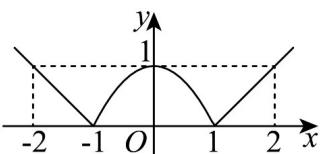

> [!faq]- 《专题02_函数的基本性质的四大常考题型_高效培优专项训练_》官方解析
>
> > [!success]- **【答案】** $^{(1)}$ 作图见解析 (2) $\frac{3}{4}$ (3)单调递减区间： $(-∞,-1]$ 和 $[0,1)$ ；单调递增区间为： $(-1,0]$ 和 $[1,+∞)$ .
>
> > [!note]- **【解析】**
> > （1）如图所示：
> >
> > 
> >
> > (2) $f\left(f\left(-\frac{3}{2}\right)\right) = f\left(\frac{3}{2} - 1\right) = f\left(\frac{1}{2}\right) = -\left(-\frac{1}{2}\right)^2 + 1 = \frac{3}{4}$ ;
> >
> > （3）由（1）得到的图象可知， $f(x)$ 的单调递减区间为 $(-∞, -1]$ 和 $[0, 1)$
> >
> > 单调递增区间为： $(-1,0]$ 和 $[1,+\infty)$ .
