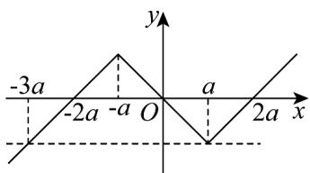

> [!faq]- 《专题02_函数的基本性质的四大常考题型_高效培优专项训练_》官方解析
>
> > [!success]- **【答案】** C
>
> > [!note]- **【解析】**
> > ；当 $x$ 0时， $x$ a时， $f(x) = x - 2a$ ；当 $0 \leq x < a$ 时， $f(x) = -x$ ；
> >
> > 故 $f(x)=\left\{\begin{aligned}x-2a,x&\quad a\\ -x,0&\leq x<a\end{aligned}\right.$
> >
> > 当 $x < 0$ 时， $-x > 0$ ，则 $f(x) = -f(-x) = \begin{cases} x + 2a, & x \leq -a \\ -x, & -a < x < 0 \end{cases}$ ，
> >
> > 综上所述： $f(x)=\left\{\begin{aligned}x-2a,x&\quad a\\ -x,-a&<x<a\\ x+2a,x&\leq-a\end{aligned}\right.$
> >
> > 画出函数图像，如图所示：
> >
> > 
> >
> > 根据图像知： $a - (-3a)\leq x + 2 - (x - 2)$ ，即 $a\leq 1$ ，故 $0 <   a\leq 1$
> >
> > 故选 **C**.
