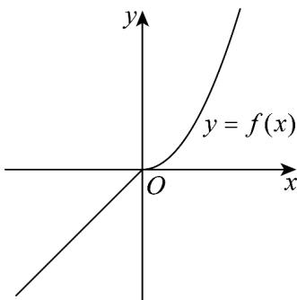

> [!faq]- 《专题02_函数的基本性质的四大常考题型_高效培优专项训练_》官方解析
>
> > [!success]- **【答案】** AC
>
> > [!note]- **【解析】**
> > 对于 $^{A}$ ， $f(x)=x^{a}$ ，将 $A\left(3,\frac{1}{27}\right)$ 代入得， $3^{a}=\frac{1}{27}$ ，解得a=-3，故 $f(x)=x^{-3}$ ，故 $^{A}$ 正确；
> > 对于 $^{B}$ ，当 $a=0$ 时， $f(x)=\begin{cases}x,x<0\\x^{2},x\quad0\end{cases}$
> >
> > 其图象如下：
> >
> > 
> >
> > 满足 $f(x)$ 在 R 上单调递增，故 B 错误；
> >
> > 对于 C，已知 $x > 0$ ，y > 0，且 $\frac{1}{x} + \frac{3}{y} = 1$ ，
> >
> > $$
> > x + 2 y = (x + 2 y) \left(\frac {1}{x} + \frac {3}{y}\right) = 1 + 6 + \frac {2 y}{x} + \frac {3 x}{y} \quad 7 + 2 \sqrt {\frac {2 y}{x} \cdot \frac {3 x}{y}} = 7 + 2 \sqrt {6}
> > $$
> >
> > 当且仅当 $\frac{2y}{x} = \frac{3x}{y}$ ，即 $x = 1 + \sqrt{6}$ ， $y = 3 + \frac{\sqrt{6}}{2}$ 时，等号成立，
> >
> > 则 $x + 2y$ 的最小值为 $7 + 2\sqrt{6}$ ，故 $\mathbb{C}$ 正确；
> >
> > 对于 $\mathsf{D}$ ，函数 $f(x)$ 是定义在 $\mathsf{R}$ 上的奇函数，且当 $x < 0$ 时， $f(x) = -x(1 + x)$
> >
> > 当 $x > 0$ 时， $-x <   0$ ，所以 $f(-x) = x(1 - x) = x - x^2$
> >
> > 又因为 $f(-x) = -f(x)$ ，所以 $f(x) = -x + x^2$
> >
> > 当 x=0 时， $f(x)=0$ ，
> >
> > 所以 $f(x)$ 的解析式为 $f(x) = \begin{cases} -x^2 - x, & x \leq 0 \\ -x + x^2, & x > 0 \end{cases}$ ，故D错误，
> >
> > 故选 **AC**.
