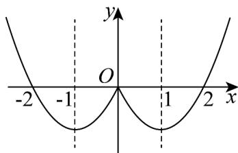

> [!faq]- 《专题02_函数的基本性质的四大常考题型_高效培优专项训练_》官方解析
>
> > [!success]- **【答案】** $(-∞,-3]∪[1,+∞)$
>
> > [!note]- **【解析】**
> > ）设 $x < 0$ ，则 $-x > 0$ ，则 $f(-x) = x^2 + 2x$ ，因为 $f(x)$ 为偶函数，
> >
> > 所以 $f(x) = f(-x) = x^2 + 2x$ ，所以 $f(x) = \begin{cases} x^2 + 2x, & x < 0 \\ x^2 - 2x, & 0 \end{cases}$ ，作出 $f(x)$ 的图象如图：
> >
> > 
> >
> > 因为函数 $f(x)$ 在区间 $[a, a + 2]$ 上具有单调性，
> >
> > 由图可得 $a + 2 \leq -1$ 或 $a = 1$ ，解得 $a \leq -3$ 或 $a = 1$
> >
> > 所以实数 a 的取值范围是 $(-∞, -3]∪[1, +∞)$ .
> >
> > 故答案为： $(-∞,-3]∪[1,+∞)$ .
