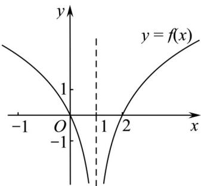

> [!faq]- 《专题02_函数的基本性质的四大常考题型_高效培优专项训练_》官方解析
>
> > [!success]- **【答案】** C
>
> > [!note]- **【解析】**
> > 函数 $y = f(x + 1)$ 向右平移1个单位得到函数 $y = f(x)$
> >
> > 由题意可知，函数 $y = f(x)$ 关于直线 $x = 1$ 对称，函数的定义域为 $(-\infty, 1) \cup (1, +\infty)$ ，因为 $y = f(x)$ 在区间 $(-\infty, 1)$ 上是减函数，所以 $y = f(x)$ 在区间 $(1, +\infty)$ 上是增函数，且 $f(0) = 0$ ，根据对称性可知， $f(2) = 0$ ，在区间 $(-\infty, 0) \cup (2, +\infty)$ ， $f(x) > 0$ 在区间 $(0, 1) \cup (1, 2)$ ， $f(x) < 0$ ，
> >
> > 
> >
> > 上图是满足函数性质的图象，
> >
> > 不等式 $(x-1)f(x)<0$ ，等价于 $\left\{\begin{aligned}x>1\\ f(x)<0\end{aligned}\right.$ 或 $\left\{\begin{aligned}x<1\\ f(x)>0\end{aligned}\right.$ ，即 $\left\{\begin{aligned}x>1\\ 0<x<2\end{aligned}\right.$ 或 $\left\{\begin{aligned}x<1\\ x\langle0或x\rangle2\end{aligned}\right.$ ，
> >
> > 得 $1 < x < 2$ 或 $x < 0$
> >
> > 所以不等式的解集为 $(-∞,0)∪(1,2)$ .
> >
> > 故选 **C**
