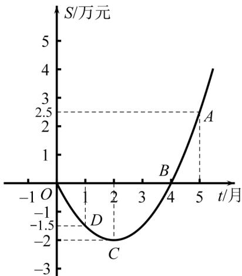

<!-- question-source:start -->
45. 某公司推出了一种高效环保型洗涤用品，年初上市后，公司经历了从亏损到盈利的过程，二次函数图象（部分）刻画了该公司年初以来累积利润S（万元）与销售时间 $t$ （月）之间的关系（即前 $t$ 个月的利润总和S与 $t$ 之间的关系）·根据图象提供的信息解答下列问题：

(1) 由已知图象上的三点坐标，求累积利润 $^{S}$ （万元）与时间 $^{t}$ （月）之间的函数关系式；

(2) 求截止到第几个月末公司累积利润可达到30万元；

(3) 求第八个月公司所获得的利润·
<!-- question-source:end -->

![[高中/课堂同步/题库/人教A版高中数学同步讲义(2026)/01_必修第一册/第三章 函数的概念与性质/专项训练/专题03_幂函数及函数的应用_一_的六大常考题型_高效培优专项训练_/题型五_sec_06/questions/answers/Q00067962A1.md]]
