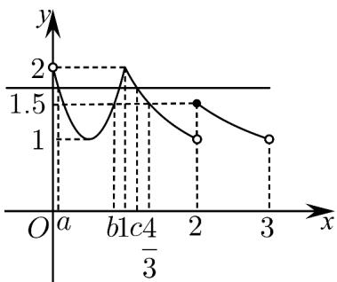

> [!faq]- 《专题03_幂函数及函数的应用_一_的六大常考题型_高效培优专项训练_》官方解析
>
> > [!success]- **【答案】** (1) $f(x)=4x^{2}-4x+2$ (2) $a + b + c \in \left(2, \frac{7}{3}\right)$
>
> > [!note]- **【解析】**
> > （1）由题可设 $f(x) = ax^{2} + bx + 2(a \neq 0)$
> >
> > 所以得 $f(x + 1) - f(x) = 2ax + (a + b) = 8x$
> >
> > $$
> > \therefore a = 4, b = - 4, f (x) = 4 x ^ {2} - 4 x + 2
> > $$
> >
> > (2) 当 x 1 时，
> >
> > 当 $1 \leq x < 2$ 时， $[x + 1] = 2$ ，所以 $g(x) = \frac{2}{x}$
> >
> > 当 $2 \leq x < 3$ 时， $[x + 1] = 3$ ，所以 $g(x) = \frac{3}{x}$
> >
> > 不妨设 $a < b < c$ ，由题可得函数 $g(x)$ 的大致图象，
> >
> > 
> >
> > 由（1）可知函数 $f(x)$ 的对称轴 $x_0 = \frac{1}{2}$ ， $f(x)_{\min} = f\left(\frac{1}{2}\right) = 1$ ，可得根据对称性知 $a + b = 1$ ，又由 $g(2) = \frac{3}{2}$ ，可得 $g(a) = g(b) = g(c) \in \left(\frac{3}{2}, 2\right)$ ，由 $\frac{2}{x} = \frac{3}{2}$ ，可得 $x = \frac{4}{3}$ ，
> >
> > 由图可知 $1 < c < \frac{4}{3}$
> >
> > 所以 $a + b + c = (1 + c) \in \left(2, \frac{7}{3}\right)$
> >
> > 故 $a+b+c\in\left(2,\frac{7}{3}\right)$ .
