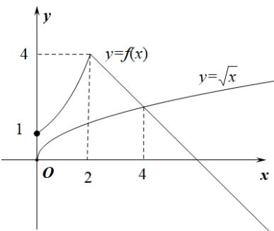

> [!faq]- 《专题03_幂函数及函数的应用_一_的六大常考题型_高效培优专项训练_》官方解析
>
> > [!success]- **【答案】** A. (0,1] B. (0,2] C. [0,4] D. [1,6]
>
> > [!note]- **【解析】**
> > 若 $f(x)\sqrt{x}$ ，当 $0\leq x\leq 1$ 时， $2^{x}1\sqrt{x}$ ；当 $1 <   x\leq 2$ 时， $2^{x} > 2\sqrt{x}$ 当 $x > 2$ ，令 $6 - x\sqrt{x}$ ，整理可得 $\left(\sqrt{x} -2\right)\left(\sqrt{x} +3\right)\leq 0$ ，且 $\sqrt{x} +3 > 0$ ，可得 $\sqrt{x}\leq 2$ ，即 $2 <   x\leq 4$ 分别作出 $y = f(x)$ 和 $y = \sqrt{x}$ 的图象，
> >
> > 
> >
> > 结合图象可知不等式 $f(x) \sqrt{x}$ 的解集为 $[0,4]$ .
> >
> > 故选 **C**.
