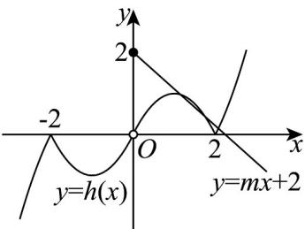
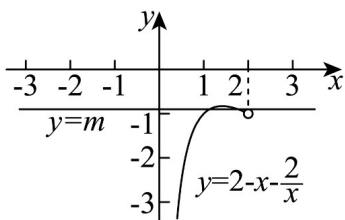

> [!faq]- 《专题02 函数的基本性质的四大常考题型（高效培优专项训练）》官方解析
>
> > [!success]- **【答案】** B
>
> > [!note]- **【解析】**
> > 由“隐对称点”的定义可知，
> > 函数 $f(x)=\left\{\begin{aligned}-\left|x^{2}+2x\right|,&x<0\\mx+2,x&0\end{aligned}\right.$ 的图象上存在关于原点对称的点，
> > 设 $h(x)$ 的图象与 $y=-\left|x^{2}+2x\right|$ , x<0 图象关于原点对称，
> > 设 x>0，则 -x<0，即 $f(-x)=-\left|x^{2}-2x\right|$ ，
> >
> > 所以 $h(x) = -f(-x) = |x^2 - 2x|$ ， $x > 0$
> >
> > 故函数 $h(x)$ 的图象与 $y = mx + 2, x = 0$ 的图象有 3 个交点，
> >
> > 如图①所示， $|x^{2}-2x|=mx+2,x>0$
> >
> > 当 $0 < x < 2$ 时， $2x - x^2 = mx + 2$ ，即 $m = 2 - x - \frac{2}{x}$ 有两个交点，如图②所示，
> >
> > 且 $m = 2 - x - \frac{2}{x} \leq 2 - 2\sqrt{x \times \frac{2}{x}} = 2 - 2\sqrt{2}$ ，当且仅当 $x = \sqrt{2}$ 时取等号，
> >
> > 所以 $-1 < m < 2 - 2\sqrt{2}$
> >
> > 当 $x > 2$ 时， $x^2 - 2x = mx + 2$ ，即 $m = x - 2 - \frac{2}{x}$ 有一个交点，
> >
> > 因为函数 $g(x)=x-2-\frac{2}{x}$ 在 x>2 单调递增，即 m>-1
> >
> > 综上所示， $-1<m<2-2\sqrt{2}$
> >
> > 故选：B.
> >
> > 
> > 图①
> >
> > 
> > 图②
