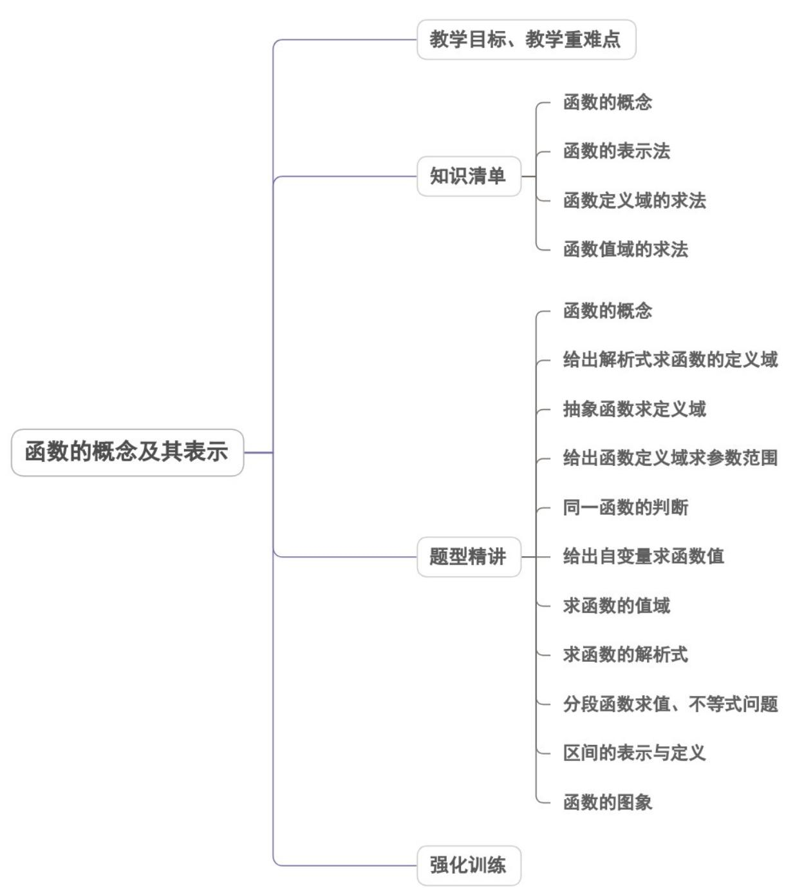
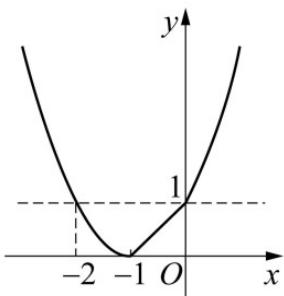

<!-- source-part:1 pages:1-50 -->

## 专题3.1 函数的概念及其表示

<table><tr><td>教学目标</td><td>1.函数的概念;2.了解函数的三要素;3.掌握简单函数的定义域;4.掌握求函数的值;5.掌握区间的写法.6.了解函数的三种表示方法及特点;7.了解与认识分段函数及其定义域</td></tr><tr><td>教学重难点</td><td>1.重点:掌握求函数解析式的常用方法2.难点:会用分析法与图象法表示分段函数,并能掌握分段函数的相关性质.</td></tr></table>

## 知识清单

## 知识点 01 函数的概念

## 1. 函数的定义

设 A、B 是非空的数集，如果按照某个确定的对应关系 $f$ ，使对于集合 A 中的任意一个数 x，在集合 B 中都有唯一确定的数 $f(x)$ 和它对应，那么就称 $f: A \to B$ 为从集合 A 到集合 B 的一个函数。记作： $y = f(x)$ ， $x \in A$ 。

其中， $x$ 叫做自变量， $x$ 的取值范围 $A$ 叫做函数的定义域；与 $x$ 的值相对应的 $y$ 值叫做函数值，函数值的集合 $\{f(x) | x \in A\}$ 叫做函数的值域。

## 2. 构成函数的三要素：定义域、对应关系和值域

① 构成函数的三个要素是定义域、对应关系和值域．由于值域是由定义域和对应关系决定的，所以，如果两

个函数的定义域和对应关系完全一致，即称这两个函数相等（或为同一函数）；

②两个函数相等当且仅当它们的定义域和对应关系完全一致，而与表示自变量和函数值的字母无关。

## 3. 区间的概念

（1）区间的分类：开区间、闭区间、半开半闭区间；

(2) 无穷区间；

(3) 区间的数轴表示.

区间表示：

$$
\{x \mid a <   x <   b \} = (a, b);
$$

$$
\{x \mid a \leq x \leq b \} = [ a, b ];
$$

$$
\{x \mid a <   x \leq b \} = (a, b ]
$$

$$
\{x \mid a \leq x <   b \} = [ a, b),
$$

$$
\{x \mid x \leq b \} = (- \infty , b ] \quad ;
$$

$$
\{x \mid a \leq x \} = [ a, + \infty)
$$

<table><tr><td>定义</td><td>名称</td><td>符号</td><td>数轴表示</td></tr><tr><td> $\{x|a< x< b\}$ </td><td>闭区间</td><td> $[a,b]$ </td><td></td></tr><tr><td> $\{x|a< x< b\}$ </td><td>开区间</td><td> $(a,b)$ </td><td></td></tr><tr><td> $\{x|a< x< b\}$ </td><td>半闭半开区间</td><td> $[a,b)$ </td><td></td></tr><tr><td> $\{x|a< x< b\}$ </td><td>半开半闭区间</td><td> $(a,b]$ </td><td></td></tr></table>

## 【即学即练】

1. 已知函数 $f(x)$ 的定义域为 $\mathbb{R}$ ，满足 $f(x + y) > f(x) \cdot f(y)$ ，且 $f(1) = 2$ ，则下列结论一定正确的是（）.

【答案】

A. $f(10) > 10^4$ B. $f(20) > 10^6$

C $f(10) < 10^4$ D $f(20) < 10^6$

【答案】B

【详解】令 y=1，则 $f(x+1)>f(x)\cdot f(1)=2f(x)$ ，

所以 $f(10) > 2f(9) > 2^{9}f(1) = 2^{10} = 1024$ ，故 A，C 错误；

令 $x = y = 10$ ，则 $f(20) > \left[f(10)\right]^2 > 1024 \times 1024 > 10^6$

故选：B

2. 函数 $f(x)$ 定义域为 $(0,+\infty)$ ，对任意 x， $y\in(0,+\infty)$ 都有 $f(xy)=f(x)+f(y)$ ，又 $f(8)=3$ ，则 $f(2)=$ () A. 1 B. 2 C. 3 D. 4

【答案】A

【详解】由已知得 $3 = f(8) = f(2 \times 4) = f(2) + f(4) = f(2) + f(2) + f(2) = 3f(2)$ ，故 $f(2) = 1$

## 知识点 02 函数的表示法

1. 函数的三种表示方法：

解析法：用数学表达式表示两个变量之间的对应关系．优点：简明，给自变量求函数值．

图象法：用图象表示两个变量之间的对应关系．优点：直观形象，反应变化趋势．

列表法：列出表格来表示两个变量之间的对应关系．优点：不需计算就可看出函数值．

2. 分段函数：

分段函数的解析式不能写成几个不同的方程，而应写函数几种不同的表达式并用个左大括号括起来，并分别

注明各部分的自变量的取值情况．

【即学即练】

1. 已知非空集合 $A$ 、 $B$ 满足： $A \cup B = R$ ， $A \cap B = \varnothing$ ，函数 $f(x) = \begin{cases} x^2, & x \in A, \\ 4x - 3, & x \in B. \end{cases}$ 已知如下两个命题：①存在唯一的非空集合对 $(A, B)$ ，使得 $y = f(x)$ 为偶函数；②存在无穷多非空集合对 $(A, B)$ ，使得方程 $f(x) = 2$ 无解·则下列选项中正确的是（）

【答案】

A．①、②都正确

B．①、②都错误

C．①正确，②错误

D．①错误，②正确

【答案】D

【详解】命题①：因为 $A \cup B = R$ ， $A \cap B = \varnothing$

所以要么 $\left\{\begin{aligned}0&\in A\\ 0&\notin B\end{aligned}\right.$ ，要么 $\left\{\begin{aligned}0&\in B\\ 0&\notin A\end{aligned}\right.$

假设存在某个非空集合对 $(A,B)$ 满足 $\left\{\begin{aligned}0&\in A\\ 0&\notin B\end{aligned}\right.$ 且使 $f(x)$ 为偶函数，

那么将元素 $^{0}$ 从集合A中取出，放入集合B，其它元素不变，得到一个新的非空集合对 $(A_{1}, B_{1})$

则新的非空集合对 $\left(A_{1},B_{1}\right)$ 使 $f(x)$ 仍然为偶函数；

假设存在某个非空集合对 $(A,B)$ 满足 $\left\{\begin{aligned}0&\in B\\ 0&\notin A\end{aligned}\right.$ 且使 $f(x)$ 为偶函数，

那么将元素 $^{0}$ 从集合B中取出，放入集合A，其它元素不变，得到一个新的非空集合对 $\left(A_{2}, B_{2}\right)$

则新的非空集合对 $\left(A_{2},B_{2}\right)$ 使 $f(x)$ 仍然为偶函数

所以当存在非空集合对 $(A,B)$ 使 $f(x)$ 为偶函数时，非空集合对 $(A,B)$ 不唯一

所以命题①错误·

命题②：

解方程 $x^{2}=2$ ，解得 $x=\pm\sqrt{2}$ ；解方程 4x-3=2，解得 $x=\frac{5}{4}$ .

当非空集合对 $(A,B)$ 满足 $\sqrt{2}\notin A,-\sqrt{2}\notin A,\frac{5}{4}\notin B$ 时，方程 $f(x)=2$ 无解

而满足这个条件的非空集合对有无穷多个，故命题②正确·

故选：D.

2. 定义 $\max \{a, b\} = \begin{cases} a, a & b, \\ b, b > a. \end{cases}$ 设函数 $f(x) = x + 1, g(x) = (x + 1)^2$ ，记函数 $F(x) = \max \{f(x), g(x)\}$ ，且函数 $F(x)$

在区间 $[m,n]$ 上的值域为 $[0,1]$ ，则区间 $[m,n]$ 的长度的最大值为（ ）A.1 B.3 C. $\frac{7}{4}$ D.2

【答案】D

【详解】令 $f(x)$ 、则 $x + 1$ ， $(x + 1)^2$ ，解得 $-1\leq x\leq 0$ ，所以 $F(x) = \max \left\{f(x),g(x)\right\} = \left\{ \begin{array}{l}(x + 1)^2,x <   - 1,\\ x + 1, - 1\leq x\leq 0,\\ (x + 1)^2,x > 0, \end{array} \right.$

则 $F(x)$ 的图象如图：

又 $F(0) = F(-2) = 1, F(-1) = 0$ ，且函数 $F(x)$ 在区间 $[m, n]$ 上的值域为 $[0, 1]$ ，当 $n = 0$ 时， $-2 \leq m \leq -1$ ；当 $m = -2$ 时， $-1 \leq n \leq 0$ ，所以当 $m = -2, n = 0$ 时，区间 $[m, n]$ 的长度取得最大值，最大值为 $2$ 。

## 知识点 03 函数定义域的求法

1. 确定函数定义域的原则

①当函数是以解析式的形式给出时，其定义域就是使函数解析式有意义的自变量的取值的集合．具体地讲，

就是考虑分母不为零，偶次根号的被开方数、式大于或等于零，零次幂的底数不为零以及我们在后面学习时

碰到的所有有意义的限制条件.

②当函数是由实际问题给出时，其定义域不仅要考虑使其解析式有意义，还要有实际意义。

③当函数用表格给出时，函数的定义域是指表格中实数 $x$ 的集合。

2. 抽象函数定义域的确定

所谓抽象函数是指用 $f(x)$ 表示的函数，而没有具体解析式的函数类型，求抽象函数的定义域问题，关键是注

意对应法则．在同一对应法则的作用下，不论接受法则的对象是什么字母或代数式，其制约条件是一致的，

都在同一取值范围内．

3. 求函数的定义域，一般是转化为解不等式或不等式组的问题，注意定义域是一个集合，其结果必须用集合

或区间来表示.

## 【即学即练】

1. 函数 $f(x)=\sqrt{x+3}-\frac{1}{x}$ 的定义域是（） A. R B. $[-3,+\infty)$ C. $(-∞,0)∪(0,+∞)$ D. $[-3,0)∪(0,+∞)$

【答案】D

【详解】根据题意，得到 $\left\{ \begin{array}{ll}x + 3 & 0\\ x\neq 0 \end{array} \right.$ ，解得 $x - 3$ 且 $x\neq 0$ ·故定义域是 $[ - 3,0)\cup (0, + \infty)$

故选：D.

2. 已知函数 $f(x + 1)$ 的定义域为 $[-1,3]$ ，则 $f(x^2)$ 的定义域为（）A. $[-2,2]$ B. $[0,4]$ C. $[1,9]$ D. $[0,8]$

【答案】A

【详解】在 $y = f(x + 1)$ 中， $x \in [-1, 3]$ ， $\therefore x + 1 \in [0, 4]$ ， $\therefore f(x)$ 的定义域是 [0,4]

故在 $f\left(x^{2}\right)$ 中 $0 \leq x^{2} \leq 4$ ，解得 $-2 \leq x \leq 2$ ， $\therefore f\left(x^{2}\right)$ 的定义域是 $[-2, 2]$ .

故选：A.

## 知识点 04 函数值域的求法

实际上求函数的值域是个比较复杂的问题，虽然给定了函数的定义域及其对应法则以后，值域就完全确定了，

但求值域还是特别要注意讲究方法，常用的方法有：

观察法：通过对函数解析式的简单变形，利用熟知的基本函数的值域，或利用函数的图象的“最高点”和“最低

点”，观察求得函数的值域；

配方法：对二次函数型的解析式可先进行配方，在充分注意到自变量取值范围的情况下，利用求二次函数的

值域方法求函数的值域；

判别式法：将函数视为关于自变量的二次方程，利用判别式求函数值的范围，常用于一些“分式”函数等；此

外，使用此方法要特别注意自变量的取值范围；

换元法：通过对函数的解析式进行适当换元，将复杂的函数化归为几个简单的函数，从而利用基本函数的取

值范围来求函数的值域.

求函数的值域没有通用的方法和固定的模式，除了上述常用方法外，还有最值法、数形结合法等．总之，求

函数的值域关键是重视对应法则的作用，还要特别注意定义域对值域的制约。

【即学即练】

1. 下列说法正确的是（）

【答案】

A. $f(x) = \frac{|x|}{x}$ 与 $g(x) = \begin{cases} 1, & x = 0 \\ -1, & x < 0 \end{cases}$ 表示同一个函数

B．函数 $y = f(x)$ 的图象与直线 x = 1 的交点可以有多个

C. $f(x)=\frac{1}{x^{2}+2}$ 的值域是 $(0,\frac{1}{2}]$

D. $x + \frac{1}{x}$ 的最小值是2

【答案】C

【详解】对于A： $f(x) = \frac{|x|}{x}$ 的定义域为 $\{x\mid x\neq 0\}$

而 $g(x)=\left\{\begin{aligned}&1,x&0,\\ &-1,x&<0\end{aligned}\right.$ 的定义域为 R ，则两者不是同一函数，A 错误；

对于 B：根据函数定义知函数 $y = f(x)$ 的图象与直线 x = 1 的交点可只能有 1 个或 0 个

不可能有多个，B 错误；

对于 C：因为 $x^{2}+2\geq2$ ，所以 $0<\frac{1}{x^{2}+2}\leq\frac{1}{2}$ ，则 $f(x)=\frac{1}{x^{2}+2}$ 的其值域为 $\left(0,\frac{1}{2}\right]$ ，C 正确；

对于D：当 $x > 0$ 时， $x + \frac{1}{x} = 2\sqrt{x \cdot \frac{1}{x}} = 2$ ，当且仅当 $x = \frac{1}{x}$ ，即 $x = 1$ 时取等号，

当 $x < 0$ 时， $-x > 0$ ，则 $x + \frac{1}{x} = -[(-x) + \frac{1}{-x}] \leq 2\sqrt{(-x) \cdot \frac{1}{-x}} = -2$

当且仅当 $-x=\frac{1}{-x}$ ，即 x=-2 时取等号，所以 $x+\frac{1}{x}$ 的最小值不是 2，D 错误

故选：C

2. 定义运算“\*”： $a*b=\begin{cases}b,a&b\\a,a<b\end{cases}$ ，则函数 $y=(-x^{2}-2x+3)*(-x+1)$ 的值域为（）

【答案】
A. $(-∞,3]$ B. $(-∞,4]$ C. $[0,+∞)$ D. $(-∞,+∞)$

【答案】A

【详解】由 $-x^{2}-2x+3-x+1$ ，可得 $-2\leq x\leq1$ ，

所以 $y=\left\{\begin{aligned}-x+1,x&\in[-2,1]\\ -x^{2}-2x+3,x&\in(-\infty,-2)\cup(1,+\infty)\end{aligned}\right.$

当 $x \in [-2,1]$ 时， $y = -x + 1 \in [0,3]$ ，

当 $x \in (-\infty, -2)$ 时， $y = -x^2 - 2x + 3 = -(x + 1)^2 + 4$ 在 $(- \infty, -2)$ 上单调递增，所以 $y < -(-2)^2 + 4 + 3 = 3$

当 $x \in (1, +\infty)$ 时， $y = -x^2 - 2x + 3 = -(x + 1)^2 + 4$ 在 $(1, +\infty)$ 上单调递减，所以 $y < -1^2 - 2 + 3 = 0$

所以 $y=(-x^{2}-2x+3)*(-x+1)$ 的值域为 $(-∞,3]$ .

故选：A.

## 题型精讲

![[高中/课堂同步/题库/人教A版高中数学同步讲义(2026)/01_必修第一册/第三章 函数的概念与性质/专题3.1 函数的概念及其表示（高效培优讲义）/题型01_函数的概念/题型01_函数的概念.md]]
![[高中/课堂同步/题库/人教A版高中数学同步讲义(2026)/01_必修第一册/第三章 函数的概念与性质/专题3.1 函数的概念及其表示（高效培优讲义）/题型02_给出解析式求函数的定义域/题型02_给出解析式求函数的定义域.md]]
![[高中/课堂同步/题库/人教A版高中数学同步讲义(2026)/01_必修第一册/第三章 函数的概念与性质/专题3.1 函数的概念及其表示（高效培优讲义）/题型03_抽象函数求定义域/题型03_抽象函数求定义域.md]]
![[高中/课堂同步/题库/人教A版高中数学同步讲义(2026)/01_必修第一册/第三章 函数的概念与性质/专题3.1 函数的概念及其表示（高效培优讲义）/题型04_给出函数定义域求参数范围/题型04_给出函数定义域求参数范围.md]]
![[高中/课堂同步/题库/人教A版高中数学同步讲义(2026)/01_必修第一册/第三章 函数的概念与性质/专题3.1 函数的概念及其表示（高效培优讲义）/题型05_同一函数的判断/题型05_同一函数的判断.md]]
![[高中/课堂同步/题库/人教A版高中数学同步讲义(2026)/01_必修第一册/第三章 函数的概念与性质/专题3.1 函数的概念及其表示（高效培优讲义）/题型06_给出自变量求函数值/题型06_给出自变量求函数值.md]]
![[高中/课堂同步/题库/人教A版高中数学同步讲义(2026)/01_必修第一册/第三章 函数的概念与性质/专题3.1 函数的概念及其表示（高效培优讲义）/题型07_求函数的值域/题型07_求函数的值域.md]]
![[高中/课堂同步/题库/人教A版高中数学同步讲义(2026)/01_必修第一册/第三章 函数的概念与性质/专题3.1 函数的概念及其表示（高效培优讲义）/题型08_求函数的解析式/题型08_求函数的解析式.md]]
![[高中/课堂同步/题库/人教A版高中数学同步讲义(2026)/01_必修第一册/第三章 函数的概念与性质/专题3.1 函数的概念及其表示（高效培优讲义）/题型09_分段函数求值_不等式问题/题型09_分段函数求值_不等式问题.md]]
![[高中/课堂同步/题库/人教A版高中数学同步讲义(2026)/01_必修第一册/第三章 函数的概念与性质/专题3.1 函数的概念及其表示（高效培优讲义）/题型10_区间的表示与定义/题型10_区间的表示与定义.md]]
![[高中/课堂同步/题库/人教A版高中数学同步讲义(2026)/01_必修第一册/第三章 函数的概念与性质/专题3.1 函数的概念及其表示（高效培优讲义）/题型11_函数的图象/题型11_函数的图象.md]]
![[高中/课堂同步/题库/人教A版高中数学同步讲义(2026)/01_必修第一册/第三章 函数的概念与性质/专题3.1 函数的概念及其表示（高效培优讲义）/强化训练/强化训练.md]]
