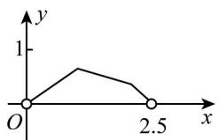
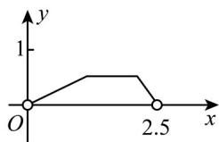
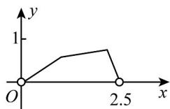
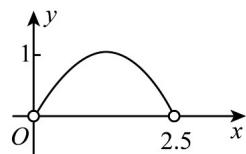

<!-- question-source:start -->
4．已知边长为1的正方形ABCD，E为CD边的中点，动点P在正方形ABCD边上沿 $A\to B\to C\to E$ 运动，

设点 $P$ 经过的路程为 $x$ ，VAPE的面积为 $y$ ，则 $y$ 关于 $x$ 的函数的图像大致为（）

A

B

C

D

<!-- question-source:end -->

![[高中/课堂同步/题库/人教A版高中数学同步讲义(2026)/01_必修第一册/第三章 函数的概念与性质/专题3.1 函数的概念及其表示（高效培优讲义）/强化训练/questions/answers/Q00074425A1.md]]
