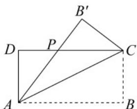

<!-- question-source:start -->
8. 如图，某制冷设备厂设计生产一种长方形薄板，长方形 $ABCD(AB > AD)$ 的周长为 $4\mathrm{m}$ ，沿 $AC$ 折叠使点 $B$

到点 $B^{\prime}$ 位置， $AB^{\prime}$ 交 $DC$ 于点 $P$ 。研究发现当 $\triangle ADP$ 的面积最大时最节能。设 $AB = x, PD = y$ ，则下列结论正

确的是（）

A. y 与 x 之间的关系是 $y = 2 \left(1 - \frac{1}{x}\right) (1 < x < 2)$

B. $x$ 的取值范围是 $(0,2)$

C. $\triangle ADP$ 的面积 $S$ 与 $x$ 的关系是

$$
S = 3 - x - \frac {2}{x} (1 <   x <   2)
$$

D．最节能时，长方形ABCD的面积为 $(2\sqrt{2}-2)\mathrm{m}^{2}$
<!-- question-source:end -->

![[高中/课堂同步/题库/人教A版高中数学同步讲义(2026)/01_必修第一册/第三章 函数的概念与性质/专题3.1 函数的概念及其表示（高效培优讲义）/强化训练/questions/answers/Q00074429A1.md]]
