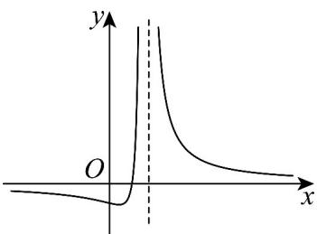

> [!faq]- 《专题3.1 函数的概念及其表示（高效培优讲义）》官方解析
>
> > [!success]- **【答案】** A. $2^{2025}$ B. $2^{2027}$ C. 2025 D. 2027
>
> > [!note]- **【解析】**
> > 由函数 $f(x)$ 在定义域 $(0, +\infty)$ 上是单调函数，且 $f(f(x) - \log_2 x) = 3$
> >
> > 知 $f(x) - \log_2 x$ 是一个常数，令 $f(x) - \log_2 x = t$ ，则 $f(x) = t + \log_2 x$
> >
> > $$
> > \therefore f (t) = t + \log_ {2} t = 3
> > $$
> >
> > ∵ $f(x)$ 在定义域 $(0, +\infty)$ 上单调，且 $f(2) = 2 + \log_{2} 2 = 3$ ，
> >
> > $\therefore t = 2$ ，即 $f(x) = 2 + \log_2x$
> >
> > $$
> > f \left(2 ^ {2 0 2 5}\right) - 2 = \log_ {2} 2 ^ {2 0 2 5} = 2 0 2 5
> > $$
> >
> > 故选：C.
> >
> > 2. 函数 $f(x) = \frac{ax + b}{(x + c)^2}$ 的图象如图所示，则（）
> >
> > 【答案】
> >
> > 
> >
> > A. $a <   0,b <   0,c <   0$ $\mathsf{B}_{\cdot}a > 0,b <   0,c <   0$ C. $a > 0,b > 0,c > 0$ D. $a <   0,b > 0,c > 0$
> >
> > 【答案】B
> >
> > 【详解】依题意，函数 $f(x)$ 的定义域为 $\{x: x \neq -c\}$ 。由图象可得 $-c > 0$ ，所以 $c < 0$ ；由 $f(0) = \frac{b}{c^2} < 0$ ，所以 $b < 0$ ；由图可知 $a \neq 0$ ，否则当 $a = 0$ 时， $f(x) = 0$ 无解，和 $x$ 轴无交点，不符题意，令 $f(x) = 0$ ，得 $x = -\frac{b}{a} > 0$ ，所以 $a > 0$ 。
> >
> > 故选 **B**.
