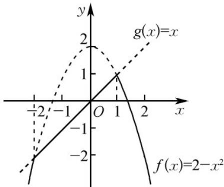

> [!faq]- 《专题3.1 函数的概念及其表示（高效培优讲义）》官方解析
>
> > [!success]- **【答案】** 1
>
> > [!note]- **【解析】**
> > 当 $2 - x^{2} > x$ ，即 $-2 < x < 1$ 时， $h(x) = x$ ；当 $2 - x^{2} \leq x$ ，即 $x - 1$ 或 $x \leq -2$ 时， $h(x) = 2 - x^{2}$ ，故
> >
> > $h(x)=\left\{\begin{aligned}&x,&-2<x<1,\\ &2-x^{2},&x\leq1 或 x\leq-2.\end{aligned}\right.$ 画出 $h(x)$ 的图象如图实线部分所示示，由图象易知当 $h(x)=1$ 时，x=1。
> >
> > 
