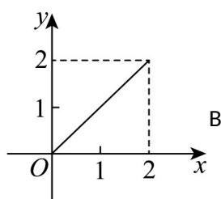
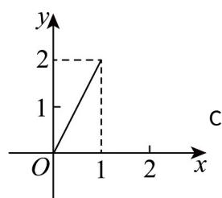
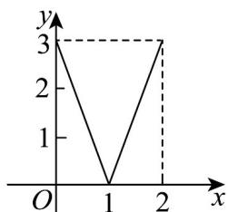

> [!faq]- 《专题3.1 函数的概念及其表示（高效培优讲义）》官方解析
>
> > [!success]- **【答案】** A   
>
> > [!note]- **【解析】**
> > 对于数集 A 中的任意一个元素，在数集 B 中都有唯一确定的元素和其对应，
> >
> > 则满足从集合 $A$ 到集合 $B$ 的函数关系，
> >
> > 其中 $^{AD}$ 满足， $^{B}$ 选项中自变量范围为 $[0,1]$ ，不是 $[0,2]$ ， $^{B}$ 错误；
> >
> > $^{C}$ 选项，因变量的取值范围是 $[0,3]$ ，不是 $[0,2]$ 的子集， $^{C}$ 错误.
> >
> > 故选 **AD**
