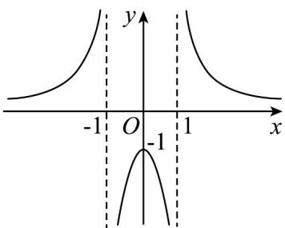

<!-- question-source:start -->
【典例1】函数 $f(x) = \frac{n}{|x| - m}$ 的图象如图，则 $f(x)\leq m - 2n$ 的解集为（）

A. $(- \infty, -2)$ B. $\left(1, \frac{3}{2}\right)$

C. $\left(-\frac{1}{2},\frac{1}{2}\right)$ D. $(-1,1)$
<!-- question-source:end -->

![[高中/课堂同步/题库/人教A版高中数学同步讲义(2026)/01_必修第一册/第三章 函数的概念与性质/专题3.1 函数的概念及其表示（高效培优讲义）/题型11_函数的图象/questions/answers/Q00074419A1.md]]
