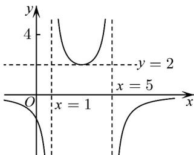

<!-- question-source:start -->
【变式1】若函数 $f(x) = \frac{d}{ax^2 + bx + c} (a, b, c, d \in R)$ 的图象如图所示，则 $a:b:c:d = ()$

A 1:6:5:8

B 1:6:5:(-8)

C. 1:(-6):5:8

D. $1:(-6):5:(-8)$
<!-- question-source:end -->

![[高中/课堂同步/题库/人教A版高中数学同步讲义(2026)/01_必修第一册/第三章 函数的概念与性质/专题3.1 函数的概念及其表示（高效培优讲义）/题型11_函数的图象/questions/answers/Q00074420A1.md]]
