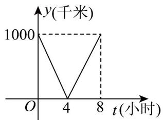
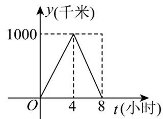
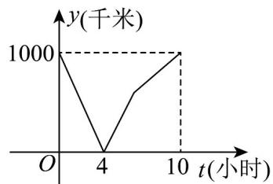
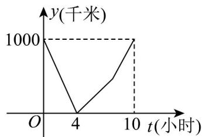

<!-- question-source:start -->
【变式2】一列快车从甲地驶往乙地，一列特快车从乙地驶往甲地，快车的速度为 $100$ 千米/小时，特快车的

速度为 $150$ 千米/小时，甲乙两地之间的距离为 $1000$ 千米，两车同时出发，则图中折线大致表示两车之间的

距离 $y$ （千米）与快车行驶时间 $t$ （小时）之间的函数图象是（ ）

B

C

D

<!-- question-source:end -->

![[高中/课堂同步/题库/人教A版高中数学同步讲义(2026)/01_必修第一册/第三章 函数的概念与性质/专题3.1 函数的概念及其表示（高效培优讲义）/题型11_函数的图象/questions/answers/Q00074421A1.md]]
