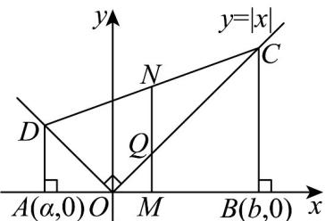

<!-- question-source:start -->
【变式3】如图，已知直角梯形ABCD的顶点 $A(a,0)$ 、 $B(b,0)$ 位于 $x$ 轴上，顶点 $C$ 、 $D$ 落在函数 $y = |x|$ 的图

象上，M、N 分别为线段 AB、CD 的中点，O 为坐标原点，Q 为线段 OC 与线段 MN 的交点.

(1)求中点 $M$ 的坐标，以及线段 $MQ, MN$ 的长度；

(2)用不等式表示MQ、MN长度的大小关系.
<!-- question-source:end -->

![[高中/课堂同步/题库/人教A版高中数学同步讲义(2026)/01_必修第一册/第三章 函数的概念与性质/专题3.1 函数的概念及其表示（高效培优讲义）/题型11_函数的图象/questions/answers/Q00074422A1.md]]
