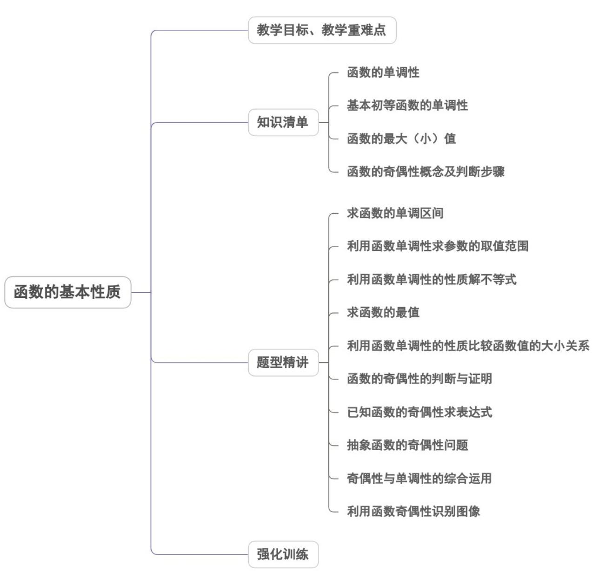
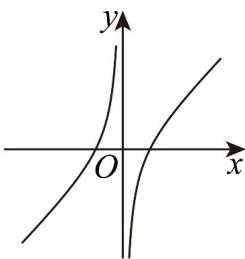
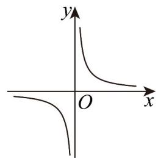
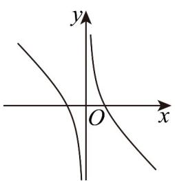
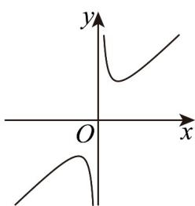

<!-- source-part:1 pages:1-50 -->

专题3.2 函数的基本性质

## 教学目标、教学重难点

<table><tr><td>教学目标</td><td>1.理解单调函数的定义,理解增函数、减函数、单调区间、单调性的定义.2.掌握定义法证明函数单调性的步骤.3.掌握函数单调区间的写法4.理解函数的最大(小)值的概念及其几何意义5.会借助单调性求最值6.掌握求二次函数在给定区间上的最值7.了解函数奇偶性的含义,掌握判断函数奇偶性的方法,了解奇偶性与函数图象对称性之间的关系.</td></tr><tr><td>教学重难点</td><td>1.重点:利用函数的奇偶性求函数解析式,利用函数的奇偶性解有关函数不等式,利用函数的奇偶性求参数范围2.难点:能解决与函数单调性、奇偶性、周期性有关的综合问题.</td></tr></table>

## 知识清单

## 知识点 01 函数的单调性

## 1. 增函数、减函数的概念

一般地，设函数 $f(x)$ 的定义域为 $A$ ，区间 $D\subseteq A$

如果对于 $D$ 内的任意两个自变量的值 $x_{1}, x_{2}$ ，当 $x_{1} < x_{2}$ 时，都有 $f(x_{1}) < f(x_{2})$ ，那么就说 $f(x)$ 在区间 $D$ 上是

增函数．如果对于 D 内的任意两个自变量的值 $x_{1}, x_{2}$ ，当 $x_{1} < x_{2}$ 时，都有 $f(x_{1}) > f(x_{2})$ ，那么就说 $f(x)$ 在区

间 $D$ 上是减函数.

## 2. 单调性与单调区间

## (1) 单调区间的定义

如果函数 $f(x)$ 在区间 $D$ 上是增函数或减函数，那么就说函数 $f(x)$ 在区间 $D$ 上具有单调性， $D$ 称为函数

$f(x)$ 的单调区间．函数的单调性是函数在某个区间上的性质．

3. 证明函数单调性的步骤

（1）取值．设 $x_{1}, x_{2}$ 是 $f(x)$ 定义域内一个区间上的任意两个量，且 $x_{1} < x_{2}$ ；

(2) 变形．作差变形（变形方法：因式分解、配方、有理化等）或作商变形；

(3) 定号．判断差的正负或商与 1 的大小关系；

(4) 得出结论.

4. 函数单调性的判断方法

(1) 定义法：根据增函数、减函数的定义，按照“取值—变形—判断符号—下结论”进行判断。

（2）图象法：就是画出函数的图象，根据图象的上升或下降趋势，判断函数的单调性.

（3）直接法：就是对我们所熟悉的函数，如一次函数、二次函数、反比例函数等，直接写出它们的单调区间。

（4）记住几条常用的结论

① 若 $f(x)$ 是增函数，则 $-f(x)$ 为减函数；若 $f(x)$ 是减函数，则 $-f(x)$ 为增函数；

②若 $f(x)$ 和 $g(x)$ 均为增（或减）函数，则在 $f(x)$ 和 $g(x)$ 的公共定义域上 $f(x) + g(x)$ 为增（或减）函数；

③若 $f(x) > 0$ 且 $f(x)$ 为增函数，则函数 $\sqrt{f(x)}$ 为增函数， $\frac{1}{f(x)}$ 为减函数；若 $f(x) > 0$ 且 $f(x)$ 为减函数，

则函数 $\sqrt{f(x)}$ 为减函数， $\frac{1}{f(x)}$ 为增函数。

【即学即练】

1. 已知函数 $f(x) = \begin{cases} -x + 3a, & x = 0, \\ x^2 - ax + 1, & x < 0 \end{cases}$ 是 $\mathbf{R}$ 上的减函数，则实数 $a$ 的取值范围是（）A. $[0, +\infty)$ B. $\left[0, \frac{1}{3}\right]$ C. $\left[0, \frac{1}{3}\right)$ D. $(- \infty, 0) \cup \left(\frac{1}{3}, +\infty\right)$

【答案】B

【详解】当 $x < 0$ 时， $f(x) = x^2 - ax + 1$ 是单调递减的，即有 $\frac{a}{2} = 0$ ，解得 $a = 0$ ；当 $x = 0$ 时，函数 $f(x) = -x + 3a$ 是单调递减的，分界点 $x = 0$ 处的值应满足 $1 - 3a$ ，解得 $a \leq \frac{1}{3}$ 。综上， $0 \leq a \leq \frac{1}{3}$ 。

2. 已知函数 $f(x) = ax^2 - 4x + 6$ . 若函数 $y = \sqrt{f(x)}$ 的值域为 $[0, +\infty)$ ，则实数 $a$ 的取值范围是（）A. $\left(-\infty, \frac{2}{3}\right]$ B. $\left[\frac{2}{3}, +\infty\right)$ C. $\left(0, \frac{2}{3}\right]$ D. $\left[0, \frac{2}{3}\right]$

【答案】D

【详解】函数 $y=\sqrt{f(x)}$ 的值域为 $[0,+\infty)$ ，即 $f(x)$ 的值域包含 $[0,+\infty]$ 这一子区间。故当 a=0 时， $f(x)=-4x+6$ ，此时 $f(x)$ R，此时 $a<0$ ，是开口向下的二次函数，显然，值域不
可能包含 $[0,+\infty)$ 这一区间，故不符合题意；当a>0时，需要 $f(x)$ 与x轴有交点，才能完全包含 $[0,+\infty)$ 这一
区间，此时 $\Delta=b^{2}-4ac\quad0$ ，即 $(-4)^{2}-24a\quad0$ ，解得 $a\leq\frac{2}{3}$ 。综上， $0\leq a\leq\frac{2}{3}$

## 知识点 02 基本初等函数的单调性

1. 正比例函数 $y = kx (k \neq 0)$

当 $k > 0$ 时，函数 $y = kx$ 在定义域 $R$ 是增函数；当 $k < 0$ 时，函数 $y = kx$ 在定义域 $R$ 是减函数。

## 2. 一次函数 $y = kx + b (k \neq 0)$

当 $k > 0$ 时，函数 $y = kx + b$ 在定义域 $R$ 是增函数；当 $k < 0$ 时，函数 $y = kx + b$ 在定义域 $R$ 是减函数。

3. 反比例函数 $y = \frac{k}{x} (k \neq 0)$

当 $k > 0$ 时，函数 $y = \frac{k}{x}$ 的单调递减区间是 $(- \infty, 0), (0, +\infty)$ ，不存在单调增区间；

当 $k < 0$ 时，函数 $y = \frac{k}{x}$ 的单调递增区间是 $(- \infty, 0), (0, +\infty)$ ，不存在单调减区间。

## 4. 二次函数 $y = ax^{2} + bx + c (a \neq 0)$

若 $a > 0$ ，在区间 $(- \infty, -\frac{b}{2a}]$ ，函数是减函数；在区间 $[- \frac{b}{2a}, + \infty)$ ，函数是增函数；

若 $a < 0$ ，在区间 $(- \infty, -\frac{b}{2a}]$ ，函数是增函数；在区间 $[- \frac{b}{2a}, + \infty)$ ，函数是减函数。

## 【即学即练】

1. 函数 $f(x) = \frac{x - 1}{x}$ , $x \in \left[\frac{1}{2}, 2\right]$ 的值域为（）

【答案】
A. $\left[-1, \frac{1}{2}\right]$ B. $\left[-1, 2\right]$ C. $\left[\frac{1}{2}, 2\right]$ D. $\left[\frac{1}{2}, 1\right]$

【答案】A

【详解】由题意， $f(x)=\frac{x-1}{x}=1-\frac{1}{x}$ ，当 $x\in\left[\frac{1}{2},2\right]$ 时，函数 $f(x)$ 单调递增，

当 $x = \frac{1}{2}$ 时，函数取得最小值，最小值为 $f\left(\frac{1}{2}\right) = 1 - \frac{1}{\frac{1}{2}} = 1 - 2 = -1$ ；当 $x = 2$ 时，函数取得最大值，最大值为

$f(2) = 1 - \frac{1}{2} = \frac{1}{2}$

∴函数 $f(x)$ 的值域为 $\left[-1,\frac{1}{2}\right]$ .

故选：A.

2. 函数 $f(x) = ax + \frac{1}{x} (a \in \mathbf{R})$ 的图象不可能是（）

【答案】

A

B

C

D

【答案】A

【详解】当 $a = 0$ 时， $f(x) = \frac{1}{x}$ ，对应图象是B选项·

当 a > 0 时，对应图象是 D 选项.

当 $a < 0$ 时， $f(x)$ 在 $(- \infty, 0), (0, +\infty)$ 上单调递减，

对应图象是 $^{C}$ 选项.

所以不可能的是 A 选项·

故选：A

知识点 03 函数的最大（小）值

1、最大值：对于函数 $y = f(x)$ ，其定义域为 $D$ ，如果存在 $x_0 \in D$ ， $f(x) = M$ ，使得对于任意的 $x \in D$ ，都有 $f(x) \leq M$ ，那么，我们称 $M$ 是函数 $y = f(x)$ 的最大值，即当 $x = x_0$ 时， $f(x_0)$ 是函数 $y = f(x)$ 的最大值，记作 $y_{\max} = f(x_0)$ .

2、最小值：对于函数 $y = f(x)$ ，其定义域为 $D$ ，如果存在 $x_0 \in D$ ， $f(x) = M$ ，使得对于任意的 $x \in D$ ，都有 $f(x) = M$ ，那么，我们称 $M$ 是函数 $y = f(x)$ 的最小值，即当 $x = x_0$ 时， $f(x_0)$ 是函数 $y = f(x)$ 的最小值，记作 $y_{\min} = f(x_0)$ .

3、几何意义：一般地，函数最大值对应图像中的最高点，最小值对应图像中的最低点，它们不一定只有一个。【即学即练】

1. 若函数 $f(x)$ 的值域是 $\left[\frac{1}{2}, 3\right]$ ，则函数 $F(x) = f(x) + \frac{1}{f(x)}$ 的值域是（）A. $\left[\frac{1}{2}, 3\right]$ B. $\left[2, \frac{10}{3}\right]$ C. $\left[\frac{5}{2}, \frac{10}{3}\right]$ D. $\left[\frac{5}{6}, 5\right]$

【答案】B

【详解】解：令 $f(x) = t$ ， $y = t + \frac{1}{t}$ ，则 $t \in \left[\frac{1}{2}, 3\right]$

当 $t \in \left[\frac{1}{2}, 1\right)$ 时， $y = t + \frac{1}{t}$ 单调递减，

当 $t \in [1,3]$ 时， $y = t + \frac{1}{t}$ 单调递增，

又当 $t=\frac{1}{2}$ 时， $y=\frac{5}{2}$ ，当 t=1 时，y=2，当 t=3 时， $y=\frac{10}{3}$

所以函数 $F(x)$ 的值域为 $\left[2, \frac{10}{3}\right]$

故选：B.

2. 已知 $y = m^4 - 4m^2n + 3m^2 - 2mn + 5n^2 - 4n + 1, m, n \in \mathbb{R}$ ，则 $y$ 的最小值为（）A. 1 B. $\sqrt{17}$ C. $\sqrt{10}$ D. 0

【答案】D

【详解】根据题意 $5n^{2} + (-4m^{2} - 2m - 4)n + m^{4} + 3m^{2} + 1 - y = 0$

若方程有解，则 $\Delta = 4\left(2m^2 + m + 2\right)^2 - 20\left(m^4 + 3m^2 + 1 - y\right) = 0$

即 $4m^{4} + m^{2} + 4 + 4m^{3} + 4m + 8m^{2} - 5m^{4} - 15m^{2} - 5 + 5y = 0$

所以 $5y \quad m^4 - 4m^3 + 6m^2 - 4m + 1 = (m - 1)^4 \quad 0$

当 $m = 1$ 时， $y = 0$ ，此时 $5n^{2} - 10n + 5 = 0$ ，即 $n = 1$ ，

也就是说当且仅当 m = n = 1 时， $y_{\min} = 0$ .

故选：D

## 知识点 04 函数的奇偶性概念及判断步骤

## 1. 函数奇偶性的概念

偶函数：若对于定义域内的任意一个 $x$ ，都有 $f(-x) = f(x)$ ，那么 $f(x)$ 称为偶函数.

奇函数：若对于定义域内的任意一个 $x$ ，都有 $f(-x) = -f(x)$ ，那么 $f(x)$ 称为奇函数.

2. 奇偶函数的图象与性质

（1）如果一个函数是奇函数，则这个函数的图象是以坐标原点为对称中心的中心对称图形；反之，如果一个

函数的图象是以坐标原点为对称中心的中心对称图形，则这个函数是奇函数。

(2) 如果一个函数为偶函数，则它的图象关于 $y$ 轴对称；反之，如果一个函数的图像关于 $y$ 轴对称，则这个

函数是偶函数.

【即学即练】

1. 已知函数 $f(x)$ 定义域为 R, $f(x-1)$ 为偶函数， $f(x)-1$ 是奇函数且 $f(1)=0$ ，则 $f(0)+f(1)+f(2)+f(3)+\cdots+f(2025)=(\quad)$ A. 2024 B. 2025 C. 2026 D. 2027

【答案】B

【详解】因为 $f(x)-1$ 为奇函数，则 $f(0)=1$ ，且函数 $f(x)$ 的图象关于 $(0,1)$ 中心对称，即 $f(x)+f(-x)=2$ ，
因为 $f(x-1)$ 为偶函数，所以 $f(x-1)=f(-x-1)$ ，则 $f(x-2)=f(-x)$ ，

所以 $f(x) + f(x - 2) = 2$ ， $f(x - 2) + f(x - 4) = 2$ ，所以 $f(x) = f(x - 4)$ ，故 $f(x)$ 的周期为4，

因为 $f(1) + f(3) = 2, f(0) + f(2) = 2$

所以 $f(0)+f(1)+f(2)+f(3)+\cdots+f(2025)=506[f(0)+f(1)+f(2)+f(3)]+f(0)+f(1)$ $=506\times4+1+0=2025$

故选：B.

2. 已知函数 $f(x)$ 是定义域为 $\mathbf{R}$ 的奇函数，且 $f(-2) = -4$ ，若函数 $g(x) = \frac{f(x)}{x}$ 在 $(0, +\infty)$ 上单调递增，则不等式 $f(x) \leq 2x$ 的解集为（）

【答案】
A. [-2,2] B. (-∞,2]
C. [-2,0] ∪ [2,+∞) D. (-∞,-2] ∪ [0,2]

【答案】D

【详解】 $f(x)$ 是定义域为R的奇函数，故 $f(-x)=-f(x)$ ， $g(x)=\frac{f(x)}{x}$ 定义域为 $(-∞,0)∪(0,+∞)$ ， $g(-x)=\frac{f(-x)}{-x}=\frac{-f(x)}{-x}=\frac{f(x)}{x}=g(x)$ ，
故 $g(x)=\frac{f(x)}{x}$ 是偶函数，
又 $g(x)$ 在 $(0,+\infty)$ 上单调递增，故 $g(x)$ 在 $(-∞,0)$ 上单调递减， $f(x)$ 是定义域为R的奇函数， $f(-2)=-4$ ，故 $f(2)=-f(-2)=4$ ，
故 $g(2)=\frac{f(2)}{2}=\frac{4}{2}=2$ ，
当x>0时， $f(x)\leq2x\Leftrightarrow\frac{f(x)}{x}\leq2\Leftrightarrow g(x)\leq2\Leftrightarrow g(x)\leq g(2)$ ，
而 $g(x)$ 在 $(0,+∞)$ 上单调递增，故 $x∈(0,2]$ ；

其中 $g(-2)=g(2)=2$

当 $x < 0$ 时， $f(x) \leq 2x \Leftrightarrow \frac{f(x)}{x} \quad 2 \Leftrightarrow g(x) \quad 2 \Leftrightarrow g(x) \quad g(-2)$

而 $g(x)$ 在 $(-∞,0)$ 上单调递减，故 $x∈(-∞,-2]$ ;

当 $x = 0$ 时， $f(0) = 0$ ，满足不等式。

综上， $x\in (-\infty , - 2]\cup [0,2]$

故选：D.

## 题型精讲

![[高中/课堂同步/题库/人教A版高中数学同步讲义(2026)/01_必修第一册/第三章 函数的概念与性质/专题3.2 函数的基本性质（高效培优讲义）/题型01_求函数的单调区间/题型01_求函数的单调区间.md]]
![[高中/课堂同步/题库/人教A版高中数学同步讲义(2026)/01_必修第一册/第三章 函数的概念与性质/专题3.2 函数的基本性质（高效培优讲义）/题型02_利用函数单调性求参数的取值范围/题型02_利用函数单调性求参数的取值范围.md]]
![[高中/课堂同步/题库/人教A版高中数学同步讲义(2026)/01_必修第一册/第三章 函数的概念与性质/专题3.2 函数的基本性质（高效培优讲义）/题型03_利用函数单调性的性质解不等式/题型03_利用函数单调性的性质解不等式.md]]
![[高中/课堂同步/题库/人教A版高中数学同步讲义(2026)/01_必修第一册/第三章 函数的概念与性质/专题3.2 函数的基本性质（高效培优讲义）/题型04_求函数的最值/题型04_求函数的最值.md]]
![[高中/课堂同步/题库/人教A版高中数学同步讲义(2026)/01_必修第一册/第三章 函数的概念与性质/专题3.2 函数的基本性质（高效培优讲义）/题型05_利用函数单调性的性质比较函数值的大小关系/题型05_利用函数单调性的性质比较函数值的大小关系.md]]
![[高中/课堂同步/题库/人教A版高中数学同步讲义(2026)/01_必修第一册/第三章 函数的概念与性质/专题3.2 函数的基本性质（高效培优讲义）/题型06_函数的奇偶性的判断与证明/题型06_函数的奇偶性的判断与证明.md]]
![[高中/课堂同步/题库/人教A版高中数学同步讲义(2026)/01_必修第一册/第三章 函数的概念与性质/专题3.2 函数的基本性质（高效培优讲义）/题型07_已知函数的奇偶性求表达式/题型07_已知函数的奇偶性求表达式.md]]
![[高中/课堂同步/题库/人教A版高中数学同步讲义(2026)/01_必修第一册/第三章 函数的概念与性质/专题3.2 函数的基本性质（高效培优讲义）/题型08_抽象函数的奇偶性问题/题型08_抽象函数的奇偶性问题.md]]
![[高中/课堂同步/题库/人教A版高中数学同步讲义(2026)/01_必修第一册/第三章 函数的概念与性质/专题3.2 函数的基本性质（高效培优讲义）/题型09_奇偶性与单调性的综合运用/题型09_奇偶性与单调性的综合运用.md]]
![[高中/课堂同步/题库/人教A版高中数学同步讲义(2026)/01_必修第一册/第三章 函数的概念与性质/专题3.2 函数的基本性质（高效培优讲义）/题型10_利用函数奇偶性识别图像/题型10_利用函数奇偶性识别图像.md]]
![[高中/课堂同步/题库/人教A版高中数学同步讲义(2026)/01_必修第一册/第三章 函数的概念与性质/专题3.2 函数的基本性质（高效培优讲义）/强化训练/强化训练.md]]
