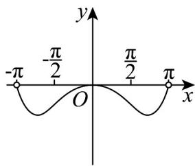
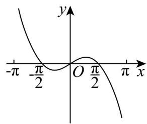
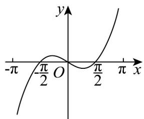
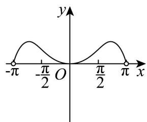
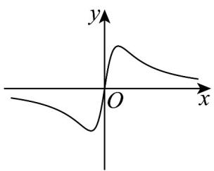
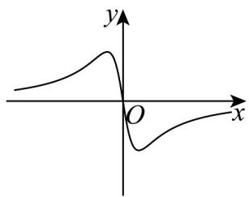
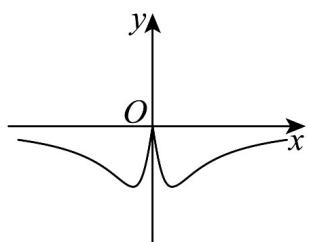
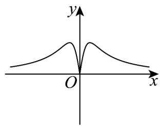

> [!faq]- 《专题3.2 函数的基本性质（高效培优讲义）》官方解析
>
> > [!success]- **【答案】** B
>
> > [!note]- **【解析】**
> > ：对任意的实数 $x_{1} \neq x_{2}$ ，都有 $\frac{f(x_1) - f(x_2)}{x_1 - x_2} < 0$ 成立，不妨设 $x_{1} > x_{2}$ ，
> >
> > $x_{1} - x_{2} > 0$ ， $f(x_{1}) - f(x_{2}) <   0$ ，∴函数 $f(x)$ 在R上单调递减·
> >
> > 当 $x \leq 1$ 时， $f(x) = x^2 + ax + 5$ 单调递减， $\therefore -\frac{a}{2} = 1$ ，解得 $a \leq -2$ ；
> >
> > 当 $x > 1$ 时， $f(x) = -\frac{a}{x}$ 单调递减， $\therefore -a > 0$ ，即 $a < 0$ ；
> >
> > 又函数 $f(x)$ 在 R 上单调递减，∴ $1^{2} + a + 5 - a$ ，解得 a -3，
> >
> > 综上所述，实数 a 的取值范围是 $-3 \leq a \leq -2$ .
> >
> > 故选：B.
> >
> > 7. 函数 $f(x) = \ln \frac{\pi - x}{\pi + x} \cos x$ 的图象大致为（）
> >
> > 【答案】
> >
> > A
> >
> > 
> >
> > B
> >
> > 
> >
> > C
> >
> > 
> >
> > D
> >
> > 
> >
> > 【答案】C
> >
> > 【详解】因为 $f(x)=\ln\frac{\pi-x}{\pi+x}\cos x$ ，所以定义域为 $-\pi<x<\pi$ .
> >
> > 那么 $f(-x) = \ln \frac{\pi + x}{\pi - x}\cos (-x) = -\ln \frac{\pi - x}{\pi + x}\cos x = -f(x)$
> >
> > 所以函数 $f(x)$ 为奇函数，关于原点对称，所以 A,D 错误.
> >
> > 特殊值代入，当 $x = \frac{\pi}{4}$ 时， $f\left(\frac{\pi}{4}\right) = \ln \frac{\pi - \frac{\pi}{4}}{\pi + \frac{\pi}{4}} \cos \frac{\pi}{4} = \frac{\sqrt{2}}{2} \ln \frac{3}{5} < 0$ ，所以 B 错误。
> >
> > 故选：C.
> >
> > 8. 函数 $y = \frac{2x}{x^2 + 1}$ 的图象大致是（）
> >
> > 【答案】
> >
> > B
> > A
> > D
> > 
> >
> > 
> >
> > C.
> >
> > 
> >
> > 
> >
> > 【答案】A
> >
> > 【详解】令 $y = f(x)$ 且定义域为 R， $f(-x) = \frac{-2x}{(-x)^{2} + 1} = -\frac{2x}{x^{2} + 1} = -f(x)$ ，即 $y = f(x)$ 为奇函数，排除 C、D；
> > 当 x > 0 时， $y = \frac{2x}{x^{2} + 1} > 0$ 恒成立，排除 B.
> >
> > 故选 **A**
