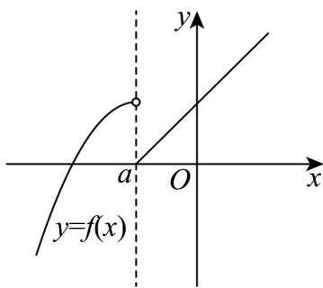

> [!faq]- 《专题3.2 函数的基本性质（高效培优讲义）》官方解析
>
> > [!success]- **【答案】** B
>
> > [!note]- **【解析】**
> > 当 $a = 0$ 时，
> >
> > 若 $x < a$ ，则 $f(x) = a(x - a)^2 + 1 > 1$
> >
> > 若 $x$ 、则 $f(x) = |x - 2a| - 1 - 1$
> >
> > 函数 $f(x)$ 的值域不可能为R；
> >
> > 当 a < 0 时，2a < a ，
> >
> > $f(x)=a(x-a)^{2}+1$ 在 $(-∞,a)$ 上单调递增，
> >
> > $f(x)=|x-2a|-1$ 在 $(a,+\infty)$ 上单调递增，，
> >
> > 若函数 $f(x)$ 的值域为 R，则 $\left|a\right|-1\leq1$ ，解得 $-2\leq a<0$ ；
> >
> > 
> >
> > 综上所述，实数 a 的取值范围是 $\left[-2,0\right)$ .
> >
> > 故选：B.
> >
> > ## 方法技巧
> >
> > 1. 解答分类问题时，我们的基本方法和步骤是：首先要确定讨论对象以及讨论对象的范围；其次要确定分类
> >
> > 标准，即标准统一、不重不漏；再对所分类逐步进行讨论，分级进行；最后进行归纳小结，综合得出结论。
> >
> > 2. 分离参数法，即把 $a$ 分离出来放到不等式的左边，不等式的右边是关于 $x$ 的函数，然后转化成求函数的最值
> >
> > 问题.
