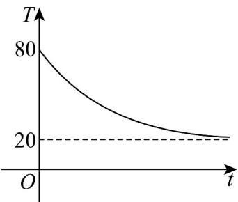
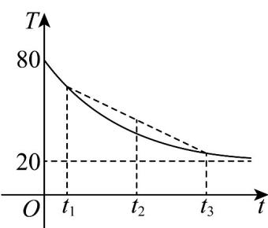

> [!faq]- 《专题3.2 函数的基本性质（高效培优讲义）》官方解析
>
> > [!success]- **【答案】**  A. 若 $t_1 + t_3 = 2t_2$ ，则 $f(t_1) + f(t_3) > 2f(t_2)$ B. 若 $t_1 + t_3 > 2t_2$ ，则 $f(t_1) + f(t_3) > 2f(t_2)$ C. 若 $f(t_1) + f(t_3) = 2f(t_2)$ ，则 $t_1 + t_3 < 2t_2$ D. 若 $f(t_1) + f(t_3) > 2f(t_2)$ ，则 $t_1 + t_3 > 2t_2$
>
> > [!note]- **【解析】**
> > 因为 $t_1 + t_3 = 2t_2$ ，所以 $\frac{t_1 + t_3}{2} = t_2$
> >
> > 
> >
> > 因为图象是上凹函数，所以 $\frac{f(t_{1})+f(t_{3})}{2}>f(t_{2})$ ，即 $f(t_{1})+f(t_{3})>2f(t_{2})$ 故 A 正确；
> >
> > 由 $\mathsf{A}$ 知 $t_4$ ，使 $t_1 + t_3 = 2t_4$ ，则 $\frac{f(t_1) + f(t_3)}{2} >f(t_4)$ ，即 $f(t_{1}) + f(t_{3}) > 2f(t_{4})$
> >
> > 由 $t_1 + t_3 > 2t_2$ ，则 $t_2 < t_4$ ， $f(t_2) > f(t_4)$ ，故无法判断 $f(t_1) + f(t_3)$ ， $2f(t_2)$ 的大小关系，故B错误；
> >
> > 由 $\mathsf{A}$ 知 $t_4$ ，使 $t_1 + t_3 = 2t_4$ ，可得 $f(t_{1}) + f(t_{3}) > 2f(t_{4})$ ，结合 $f(t_{1}) + f(t_{3}) = 2f(t_{2})$ ，可得 $f(t_{2}) > f(t_{4})$
> >
> > 由 $f(t)$ 的单调递减可得 $t_2 < t_4$ ，故 $t_1 + t_3 > 2t_2$ ，故 $\mathbb{C}$ 错误；
> > 由 $\mathbb{A}$ 知，存在 $t_4$ ，使 $t_1 + t_3 = 2t_4$ ，可得 $f(t_1) + f(t_3) > 2f(t_4)$ ，
> > 故存在 $t_0 \in (t_1, t_4)$ ，使 $2f(t_0) = f(t_1) + f(t_3)$ ，
> > 由函数的单调性可知 $t_2 \in (t_0, t_3)$ 时， $2f(t_0) > 2f(t_2)$ ，
> > 当 $t_2 \in (t_0, t_4)$ 时， $t_1 + t_3 > 2t_2$ ，
> > 当 $t_2 = t_4$ 时， $t_1 + t_3 = 2t_2$ ，
> > 当 $t_2 \in (t_4, t_3)$ 时， $t_1 + t_3 < 2t_2$ ，故 $\mathbb{D}$ 错误。
> >
> > 故选 **A**.
