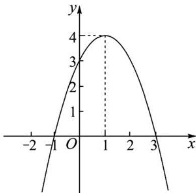

> [!faq]- 《专题3.2 函数的基本性质（高效培优讲义）》官方解析
>
> > [!success]- **【答案】** (1) $f(1) > f(0) > f(3)$ (2) $f(x_{1})<f(x_{2})$ (3) $(-1,0)\cup(3,+\infty)$
>
> > [!note]- **【解析】**
> > 解：（1）二次函数 $f(x) = -x^{2} + 2x + 3$ ，即 $f(x) = -(x - 1)^{2} + 4$ 的图象如图所示．由图象可知
> >
> > $$
> > f (1) > f (0) > f (3)
> > $$
> >
> > (2) 函数图象的对称轴为直线 $x = 1$ ，当 $\left|x_{1} - 1\right| > \left|x_{2} - 1\right|$ 时，根据函数的图象可知 $f(x_{1}) < f(x_{2})$
> >
> > 
> >
> > （3）因为不等式 $xf(x) < 0$ ，所以当 $x > 0$ 时， $f(x) < 0$ ，由图可知此时 $x > 3$ ；当 $x < 0$ 时， $f(x) > 0$ ，由图可知此时 $-1 < x < 0$ 。所以不等式 $xf(x) < 0$ 的解集为 $(-1, 0) \cup (3, +\infty)$ 。
