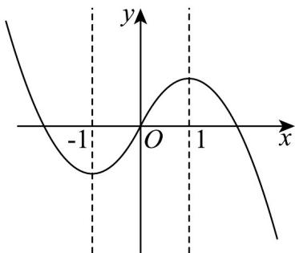

> [!faq]- 《专题3.2 函数的基本性质（高效培优讲义）》官方解析
>
> > [!success]- **【答案】** (1)2 (2)图象见解析 (3) $(1,3]$
>
> > [!note]- **【解析】**
> > （1）设 $x < 0$ ，则 $-x > 0$ ，所以 $f(-x) = -x^{2} - 2x$
> >
> > 因为函数 $f(x)$ 是奇函数，所以 $f(x) = -f(-x) = x^2 + 2x, (x < 0)$ ，
> >
> > 所以 $m = 2$
> >
> > (2) 当 x > 0 时， $f(x) = -x^{2} + 2x = -(x - 1)^{2} + 1$ ，当 x = 0 时， $f(x) = 0$ ，
> >
> > 当 $x < 0$ 时， $f(x) = x^2 + 2x = (x + 1)^2 - 1$
> >
> > 故函数 $f(x)$ 图象如图所示：
> >
> > 
> >
> > (3) 要使 $f(x)$ 在区间 $[-1, a-2]$ 上单调递增，
> >
> > 结合图象可知， $-1 < a - 2 \leq 1$ ，解得 $1 < a \leq 3$ ，
> >
> > 所以实数 a 的取值范围是 $(1,3]$ .
