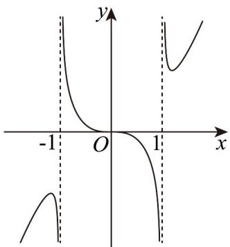
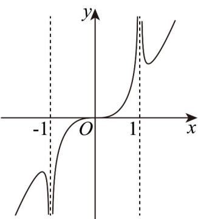
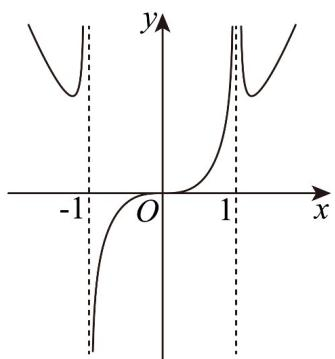

<!-- question-source:start -->
【典例1】函数 $y = \frac{x^3}{\sqrt[3]{x^4 - 1}}$ 的图像大致是（）

A

B

C

D
<!-- question-source:end -->

![[高中/课堂同步/题库/人教A版高中数学同步讲义(2026)/01_必修第一册/第三章 函数的概念与性质/专题3.2 函数的基本性质（高效培优讲义）/题型10_利用函数奇偶性识别图像/questions/answers/Q00074477A1.md]]
