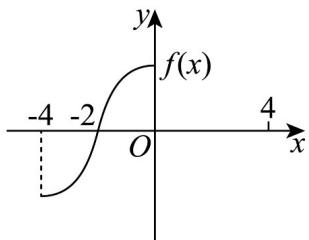
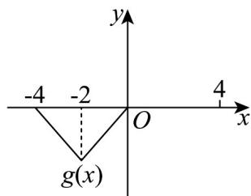

<!-- question-source:start -->
【变式3】已知偶函数 $f(x)$ 和奇函数 $g(x)$ 的定义域都是 $(-4, 4)$ ，它们在 $(-4, 0]$ 上的图像分别是图1和图2，

则关于 x 的不等式 $f(x)g(x)<0$ 的解集是 \_\_\_\_ .

图1

图2
<!-- question-source:end -->

![[高中/课堂同步/题库/人教A版高中数学同步讲义(2026)/01_必修第一册/第三章 函数的概念与性质/专题3.2 函数的基本性质（高效培优讲义）/题型10_利用函数奇偶性识别图像/questions/answers/Q00074480A1.md]]
