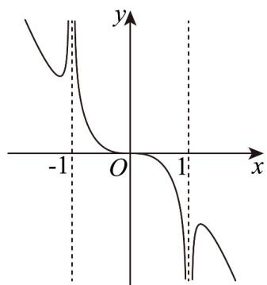

> [!faq]- 《专题3.2 函数的基本性质（高效培优讲义）》官方解析
>
> > [!success]- **【答案】** A 
>
> > [!note]- **【解析】**
> > 因为 $f(-x) = \frac{(-x)^3}{\sqrt[3]{(-x)^4 - 1}} = -\frac{x^3}{\sqrt[3]{x^4 - 1}} = -f(x)$ ，所以函数 $f(x)$ 为奇函数，图象关于原点成中心对称，
> >
> > 故 $C$ 错；
> >
> > 令 $x = \frac{1}{2}$ ，则 $f\left(\frac{1}{2}\right) < 0$ ，故B错；
> >
> > 令 x=2 ，则 $f(2)>0$ ，故 D 错.
> >
> > 选项 A 正确·
> >
> > 故选：A
> >
> > ## 方法技巧
> >
> > 利用奇偶性进行排除.
