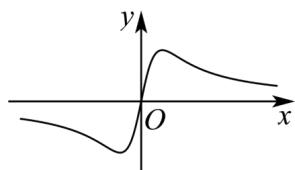
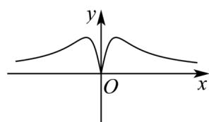
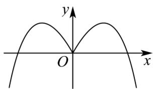
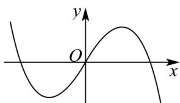

> [!faq]- 《专题3.2 函数的基本性质（高效培优讲义）》官方解析
>
> > [!success]- **【答案】** A  B  C.  D 
>
> > [!note]- **【解析】**
> > 设 $f(x) = \frac{ax}{x^2 + 1}, x \in \mathbb{R}$ ，则 $f(-x) = \frac{-ax}{x^2 + 1} = -f(x)$ ，
> >
> > <!-- source-part:2 pages:51-69 -->
> >
> > 故 $f(x)$ 为奇函数，A，D符合，排除B，C.
> >
> > 又 $a > 0$ ，所以当 $x > 0$ 时， $y = \frac{ax}{x^2 + 1} >0$ 恒成立，故A满足，D排除
> >
> > 故选 **A**
