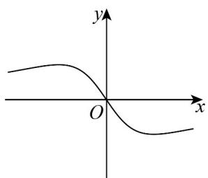
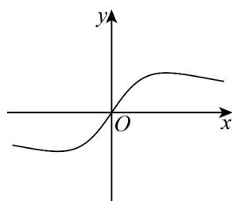
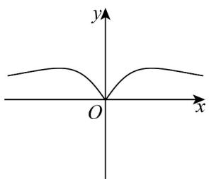
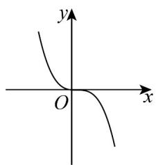

> [!faq]- 《专题3.2 函数的基本性质（高效培优讲义）》官方解析
>
> > [!success]- **【答案】** A  B  C  D 
>
> > [!note]- **【解析】**
> > 由函数 $f(x) = \frac{x}{x^2 + 1}$ ，可得 $f(-x) = \frac{-x}{(-x)^2 + 1} = -\frac{x}{x^2 + 1} = -f(x)$
> >
> > 所以函数 $f(x)$ 为奇函数，其图象关于原点对称，
> >
> > 又由 $x > 0$ 时， $f(x) > 0$ ，所以函数 $f(x)$ 图象为 $\mathsf{B}$ 选项·
> >
> > 故选 **B**.
