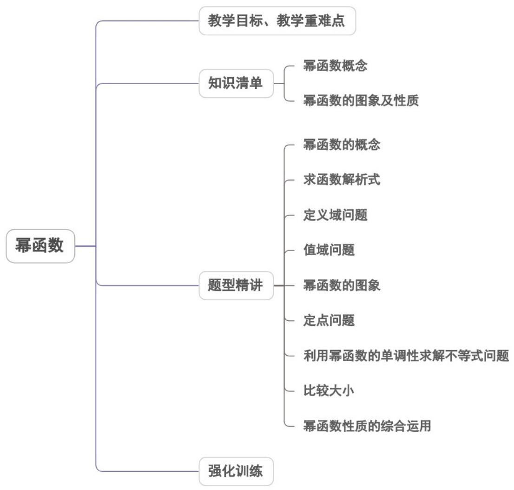
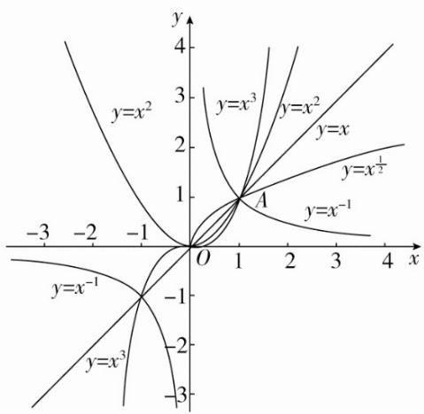
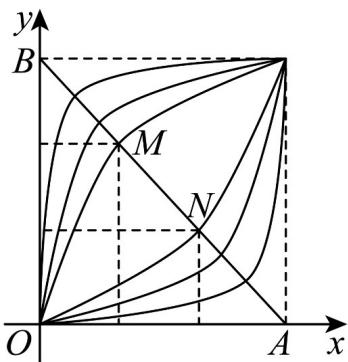

<!-- source-part:1 pages:1-50 -->

## 专题3.3 幂函数

## 内容概览

教学目标、教学重难点

知识清单

幂函数概念

幂函数的图象及性质

幂函数的概念

比较大小

## 教学目标、教学重难点

1. 了解幂函数的概念，会求幂函数的解析式；

2. 掌握常见幂函数的图像；

教学目标

3. 利用幂函数的单调性比较指数式大小。

4. 利用幂函数的性质解不等式及待定参数的求解

<table><tr><td>教学重难点</td><td>1.重点:掌握幂函数的图象与性质2.难点:利用幂函数的性质解不等式及待定参数的求解</td></tr></table>

## 知识清单

## 知识点 01 幂函数概念

形如 $y = x^{\alpha}$ 的函数，叫做幂函数，其中 $\alpha$ 为常数.

## 【即学即练】

1. 下列函数是幂函数的是（ ）A. $y = x^{2x}$ B. $y = 2^x$ C. $y = x^{\sqrt{2}}$ D. $y = 3x + 2$

【答案】C

【详解】对于 A， $y = x^{2x}$ 中指数上有变量 x，所以此函数不是幂函数，所以 A 错误，
对于 B， $y = 2^{x}$ 是指数函数，不是幂函数，所以 B 错误，
对于 C， $y = x^{\sqrt{2}}$ 是幂函数，所以 C 正确，
对于 D， $y = 3x + 2$ 是一次函数，不是幂函数，所以 D 错误，

故选：C

2. 在函数 $y = x^{-2}$ ， $y = 2x^2$ ， $y = (x + 1)^2$ ， $y = 3x$ 中，幂函数的个数为（）A.0 B.1

C 2

D 3

【答案】B

【详解】函数 $y = x^{-2}$ 是幂函数，

函数 $y = 2x^{2}$ ， $y = (x + 1)^{2}$ 都是二次函数，函数 $y = 3x$ 是一次函数，它们都不是幂函数，

所以所给函数中幂函数的个数是 1.

故选：B

## 知识点 02 幂函数的图象及性质

1. 作出下列函数的图象：

$$
(1) ^ {y = x}; (2) ^ {y = x ^ {\frac {1}{2}}}; (3) ^ {y = x ^ {2}}; (4) ^ {y = x ^ {- 1}}; (5) ^ {y = x ^ {3}}.
$$

2. 作幂函数图象的步骤如下：

(1) 先作出第一象限内的图象；

(2) 若幂函数的定义域为 $(0, +\infty)$ 或 $[0, +\infty)$ ，作图已完成；

若在 $(- \infty 0)$ 或 $(- \infty 0]$ 上也有意义，则应先判断函数的奇偶性

如果为偶函数，则根据 $y$ 轴对称作出第二象限的图象；如果为奇函数，则根据原点对称作出第三象限的图象。

3. 幂函数解析式的确定

（1）借助幂函数的定义，设幂函数或确定函数中相应量的值.

(2) 结合幂函数的性质，分析幂函数中指数的特征.

（3）如函数 $f(x) = k \cdot x^a$ 是幂函数，求 $f(x)$ 的表达式，就应由定义知必有 $k = 1$ ，即 $f(x) = x^a$ .

4. 幂函数值大小的比较

（1）比较函数值的大小问题一般是利用函数的单调性，当不便于利用单调性时，可与0和1进行比较．常称

为“搭桥”法.

（2）比较幂函数值的大小，一般先构造幂函数并明确其单调性，然后由单调性判断值的大小.

（3）常用的步骤是：①构造幂函数；②比较底的大小；③由单调性确定函数值的大小。

【即学即练】

1. 已知幂函数 $y = x^{\alpha}$ ，当 $\alpha$ 取不同的正数时，在区间 $[0,1]$ 上它们的图象是一族曲线（如图）·设点 $A(1,0)$ ，

$B(0,1)$ ，连接 $AB$ ，线段 $AB$ 恰好被其中的两个幂函数 $y = x^{\alpha}$ ， $y = x^{\beta}$ 的图象三等分，即有 $\left|BM\right| = \left|M N\right| = \left|NA\right|$

那么 $\alpha \beta =$ （ ）

A. $\frac{1}{3}$ B. $\frac{2}{3}$ C. 1 D. 3

【答案】C

【详解】由题得：点 $A(1,0)$ ， $B(0,1)$ ， $|BM| = |MN| = |NA|$

所以 $M\left(\frac{1}{3},\frac{2}{3}\right)$ ， $N\left(\frac{2}{3},\frac{1}{3}\right)$ ，分别代入 $y = x^{\alpha}$ ， $y = x^{\beta}$

因为 $\frac{2}{3} = \left(\frac{1}{3}\right)^{\alpha}$ ， $\frac{1}{3} = \left(\frac{2}{3}\right)^{\beta}$ ， $\left(\frac{1}{3}\right)^{\alpha \beta} = \left[\left(\frac{1}{3}\right)^{\alpha}\right]^{\beta} = \left(\frac{2}{3}\right)^{\beta} = \frac{1}{3}$

所以 $\alpha\beta=1$ .

故选：C.

2. 已知幂函数 $y = \left(m^{3} - 4m + 1\right)x^{m}$ 的图象与坐标轴没有公共点，则实数 m 的取值为（）

【答案】
A. 2 B. -2 C. 0 或 -2 D. 0 或 2

【答案】C

【详解】由题意可知， $\left\{\begin{aligned}m^{3}-4m+1&=1\\ m&\leq0\end{aligned}\right.$ ，解得m=0或m=-2，

故选：C

## 题型精讲

![[高中/课堂同步/题库/人教A版高中数学同步讲义(2026)/01_必修第一册/第三章 函数的概念与性质/专题3.3 幂函数（高效培优讲义）/题型01_幂函数的概念/题型01_幂函数的概念.md]]
![[高中/课堂同步/题库/人教A版高中数学同步讲义(2026)/01_必修第一册/第三章 函数的概念与性质/专题3.3 幂函数（高效培优讲义）/题型02_求函数解析式/题型02_求函数解析式.md]]
![[高中/课堂同步/题库/人教A版高中数学同步讲义(2026)/01_必修第一册/第三章 函数的概念与性质/专题3.3 幂函数（高效培优讲义）/题型03_定义域问题/题型03_定义域问题.md]]
![[高中/课堂同步/题库/人教A版高中数学同步讲义(2026)/01_必修第一册/第三章 函数的概念与性质/专题3.3 幂函数（高效培优讲义）/题型04_值域问题/题型04_值域问题.md]]
![[高中/课堂同步/题库/人教A版高中数学同步讲义(2026)/01_必修第一册/第三章 函数的概念与性质/专题3.3 幂函数（高效培优讲义）/题型05_幂函数的图象/题型05_幂函数的图象.md]]
![[高中/课堂同步/题库/人教A版高中数学同步讲义(2026)/01_必修第一册/第三章 函数的概念与性质/专题3.3 幂函数（高效培优讲义）/题型06_定点问题/题型06_定点问题.md]]
![[高中/课堂同步/题库/人教A版高中数学同步讲义(2026)/01_必修第一册/第三章 函数的概念与性质/专题3.3 幂函数（高效培优讲义）/题型07_利用幂函数的单调性求解不等式问题/题型07_利用幂函数的单调性求解不等式问题.md]]
![[高中/课堂同步/题库/人教A版高中数学同步讲义(2026)/01_必修第一册/第三章 函数的概念与性质/专题3.3 幂函数（高效培优讲义）/题型08_比较大小/题型08_比较大小.md]]
![[高中/课堂同步/题库/人教A版高中数学同步讲义(2026)/01_必修第一册/第三章 函数的概念与性质/专题3.3 幂函数（高效培优讲义）/题型09_幂函数性质的综合运用/题型09_幂函数性质的综合运用.md]]
![[高中/课堂同步/题库/人教A版高中数学同步讲义(2026)/01_必修第一册/第三章 函数的概念与性质/专题3.3 幂函数（高效培优讲义）/强化训练/强化训练.md]]
