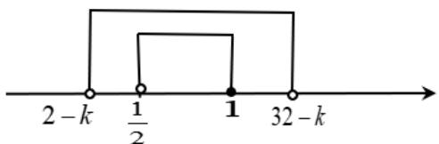

> [!faq]- 《专题3.3 幂函数（高效培优讲义）》官方解析
>
> > [!success]- **【答案】** （1） $f(x)=x^{-\frac{1}{4}}$ ， $(0,+\infty)$ ；（2） $\left[\frac{3}{2},31\right)$
>
> > [!note]- **【解析】**
> > $Qf(x)=(4t^{2}+3t)x^{-t}$ 为幂函数，且在区间 $(0,+\infty)$ 上单调递减，
> >
> > $\therefore\left\{\begin{aligned}&4t^{2}+3t=1\\ &-t<0\end{aligned}\right.$ ，即 $\left\{\begin{aligned}(4t-1)(t+1)=0\\ t>0\end{aligned}\right.$ ，解得 $t=\frac{1}{4}$ 或 $t=-1$ （舍去）
> >
> > 所以幂函数的解析式为 $f(x) = x^{-\frac{1}{4}}$
> >
> > $Qx^{-\frac{1}{4}}=\frac{1}{\sqrt[4]{x}}$ ，∴ x 0 且 $x \neq 0$ ，所以函数 $f(x)$ 的定义域为 $(0,+\infty)$
> >
> > (2) 由 (1) 知 $f(x)$ 在区间 $(0, +\infty)$ 上单调递减，所以当 $x_1 \in [1, 16)$ ， $f(x_1) \in \left(16^{-\frac{1}{4}}, 1^{-\frac{1}{4}}\right]$ ，即 $f(x_1) \in \left(\frac{1}{2}, 1\right]$
> >
> > 令 $A=\left(\frac{1}{2},1\right]$ ;
> >
> > $g(x)=2^{x}-k$ ，由指数函数性质知， $g(x)$ 单调递增，所以当 $x_{2}\in(1,5)$ ， $g(x_{2})\in(2^{1}-k,2^{5}-k)$ ，即 $g(x_{2})\in(2-k,32-k)$ ，令 $B=(2-k,32-k)$ ;
> >
> > 因为对任意的 $x_{1} \in [1,16)$ 时，总存在 $x_{2} \in (1,5)$ 使得 $f(x_{1}) = g(x_{2})$ ，则 $A \subseteq B$
> >
> > 
> >
> > 结合数轴可知 $\left\{ \begin{array}{l} 2 - k \leq \frac{1}{2} \\ 32 - k > 1 \end{array} \right.$ ，解得 $\left\{ \begin{array}{l} k = \frac{3}{2} \\ k < 31 \end{array} \right.$ ，即 $^k$ 的取值范围 $\left[\frac{3}{2}, 31\right)$
