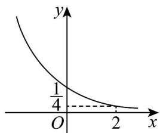
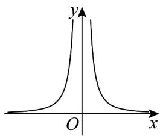
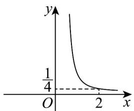
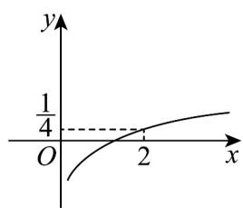

<!-- question-source:start -->
【典例1】已知幂函数的图象经过点 $P\left(2, \frac{1}{4}\right)$ ，该幂函数的大致图象为（）

A

B

C

D

<!-- question-source:end -->

![[高中/课堂同步/题库/人教A版高中数学同步讲义(2026)/01_必修第一册/第三章 函数的概念与性质/专题3.3 幂函数（高效培优讲义）/题型05_幂函数的图象/questions/answers/Q00074515A1.md]]
