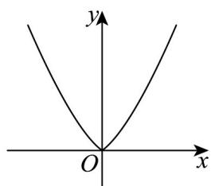
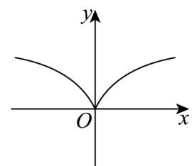
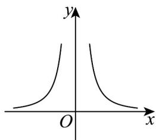
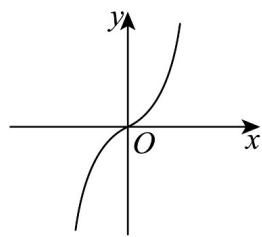

> [!faq]- 《专题3.3 幂函数（高效培优讲义）》官方解析
>
> > [!success]- **【答案】** A  B  C  D 
>
> > [!note]- **【解析】**
> > 易知函数 $y = x^{-2} = \frac{1}{x^2}$ 的定义域为 $(-\infty, 0) \cup (0, +\infty)$ ，
> >
> > 且该函数为偶函数，排除 $^{D}$ ，
> >
> > 由易知在 $(0, +\infty)$ 上该函数为单调递减，又排除 $AB$
> >
> > 故选 **C**
