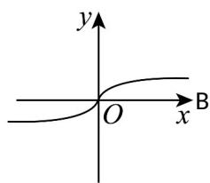
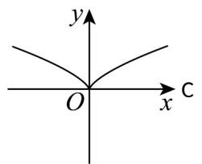
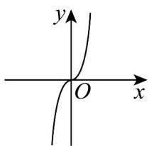
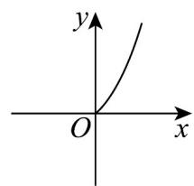

> [!faq]- 《专题3.3 幂函数（高效培优讲义）》官方解析
>
> > [!success]- **【答案】** A    
>
> > [!note]- **【解析】**
> > 幂函数 $f(x)=x^{\frac{2}{3}}=\sqrt[3]{x^{2}}$ 的定义域为 R，故 D 选项错误；
> >
> > 因为 $f(-x) = \sqrt[3]{(-x)^2} = \sqrt[3]{x^2} = f(x)$ ，所以 $f(x)$ 为偶函数，故A,C选项错误；
> >
> > 故选 **B**.
