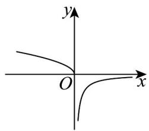
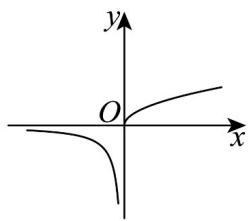
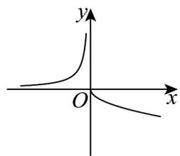
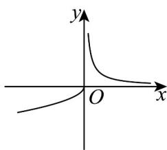

> [!faq]- 《专题3.3 幂函数（高效培优讲义）》官方解析
>
> > [!success]- **【答案】** A  B  C  D 
>
> > [!note]- **【解析】**
> > 当 $x = 0$ 时，因为 $y = \sqrt{x}$ 为单调递增函数，
> >
> > $y = -\sqrt{x}$ 与 $y = \sqrt{x}$ 关于 x 轴对称，所以 $y = -\sqrt{x}$ 单调递减，
> >
> > 当 $x < 0$ 时，因为 $y = \frac{2}{x}$ 为单调递减函数，
> >
> > $y = -\frac{2}{x}$ 与 $y = \frac{2}{x}$ 关于 $x$ 轴对称，所以 $y = -\frac{2}{x}$ 单调递增，
> >
> > 综上所述只有选项 $^{C}$ 满足条件·
> >
> > 故选 **C**.
