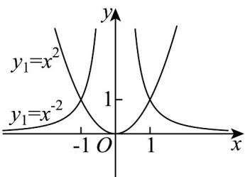

> [!faq]- 《专题3.3 幂函数（高效培优讲义）》官方解析
>
> > [!success]- **【答案】** (1) $y_{1}=x^{2}$ ; $y_{2}=x^{-2}$ (2)① x > 1 或 x < -1 ; ② x = 1 或 x = -1 ; ③ -1 < x < 1 且 $x \neq 0$
>
> > [!note]- **【解析】**
> > （1） $y_{1}=x^{a}$ ，∵图象过点 $(\sqrt{2},2)$ ，故 $2=\left(\sqrt{2}\right)^{\alpha}$ ，解得 $\alpha=2$ ，∴ $y_{1}=x^{2}$ ；
> >
> > $y_{2} = x^{\beta}$ ，∵图象过点 $\left(2,\frac{1}{4}\right)$ ，∴ $\frac{1}{4} = 2^{\beta}$ ，解得 $\beta = -2$ ∴ $y_{2} = x^{-2}$
> >
> > (2) 在同一平面直角坐标系中作出 $y_{1} = x^{2}$ 与 $y_{2} = x^{-2}$ 的图象，如图所示.
> >
> > 
> >
> > 由图象可知， $y_{1}$ 、 $y_{2}$ 的图象均过点 $(-1,1)$ 和 $(1,1)$
> >
> > 所以①当 x > 1 或 x < -1 时， $y_{1} > y_{2}$ ;
> > - **②**：当 x=1 或 x=-1 时， $y_{1}=y_{2}$ ;
> > - **③**：当-1<x<1且 $x\neq0$ 时， $y_{1}<y_{2}$
