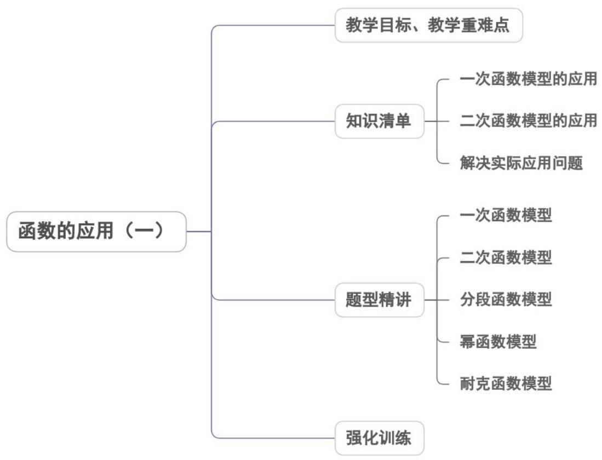
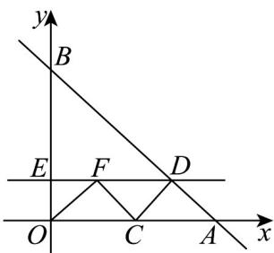
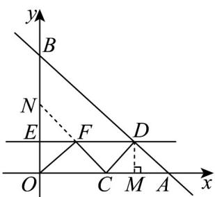
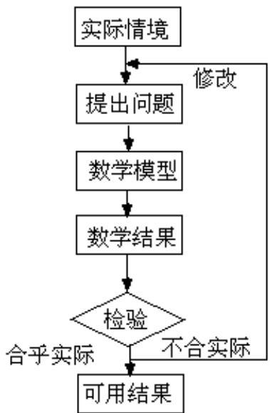

<!-- source-part:1 pages:1-47 -->

## 专题3.4 函数的应用（一）

## 内容概览

## 教学目标、教学重难点

<table><tr><td>教学目标</td><td>1.了解一次函数模型;2.掌握二次函数模型;3.学会分段函数模型。4.掌握幂函数模型</td></tr><tr><td>教学重难点</td><td>1.重点:掌握几种函数模型2.难点:根据函数模型解决实际问题。</td></tr></table>

## 知识清单

## 知识点 01 一次函数模型的应用

一次函数的一般形式： $y = kx + b (k \neq 0)$ ，其定义域是 $R$ ，值域是 $R$ 。

【即学即练】

1. 如图，在平面直角坐标系中，一次函数 $y = -x + 6$ 与坐标轴交于点 $A, B$ ，点 $C$ 为 $OA$ 上一动点，过点 $C$ 作 $CD \perp AB$ 于点 $D$ ，过点 $D$ 作 $DE \parallel x$ 轴，交 $y$ 轴于点 $E$ ，在直线 $DE$ 上找一点 $F$ ，使得 $\angle DCF = 90^\circ$ ，连接 $OF$ 当 $OF \pm CF$ 的值是小时。求点 $E$ 的坐标为（…）。

当 $OF + CF$ 的值最小时，求点 $F$ 的坐标为（）

A. $\left(1, \frac{5}{3}\right)$ B. $\left(\frac{3}{2}, \frac{3}{2}\right)$ C. (2,2) D. (3,1)

【答案】B

【详解】

解：过点 D 作 $DM \perp OA$ 于点 M，延长 CF 交 y 轴于 N，如图所示：

∵一次函数 $y = -x + 6$ 与坐标轴交于点

$$
A, B, \therefore A (6, 0), B (0, 6), \therefore O A = O B = 6, \therefore \angle B A O = 4 5 ^ {\circ}; \because C D \perp A B, \therefore \angle D C A = 4 5 ^ {\circ}, \therefore C D = A D
$$

∵ DM ⊥ AC 于 M, ∴ DM = $\frac{1}{2}$ AC = CM = AM ，设 C(m,0)，则

$$
O C = m, \therefore A C = 6 - m, \therefore D M = C M = 3 - \frac {1}{2} m, \therefore D \left(3 + \frac {1}{2} m, 3 - \frac {1}{2} m\right)
$$

延长CF交y轴于N，

$$
\because C D \perp A B, \angle D C F = 9 0 ^ {\circ}, \therefore C F \| A B
$$

当 $EN = OE$ 时，则 $OF = FN$ ，此时 $OF + CF = CN$ ，取到最小值，

∵ CN ∥ AB, OC = m, ∴ ON = m $m = 2\left(3 - \frac{1}{2}m\right)$ ，∴ 此时，解得 m = 3，

∵ E 是 ON 的中点， $DE \parallel x$ 轴， $\therefore EF = \frac{1}{2} OC = \frac{3}{2}, \therefore F\left(\frac{3}{2}, \frac{3}{2}\right)$

故选：B.

2. 2018年10月24日，世界上最长的跨海大桥—港珠澳大桥正式通车。在一般情况下，大桥上的车流速度 $^{v}$

(单位：千米/时)是车流密度 $^{x}$ （单位：辆/千米）的函数当桥上的车流密度达到 $^{220}$ 辆/千米，将造成堵塞，

此时车流速度为 $0$ ；当车流密度不超过 $20$ 辆/千米，车流速度为 $100$ 千米/时研究表明：当 $20 \leq x \leq 220$ 时，车

流速度 $^{V}$ 是车流密度 $^{X}$ 的一次函数·

(1) 当 $20 \leq x \leq 220$ 时，求函数 $v(x)$ 的表达式；

(2) 当车流密度 $x$ 为多大时，车流量（单位时间内通过桥上某观测点的车辆数，单位：辆/时）

$f(x) = x \cdot v(x)$ 可以达到最大？并求出最大值

【答案】（1） $v(x)=\left\{\begin{aligned}&100,&0\leq x\leq20\\&-\frac{1}{2}x+110,&20\leq x\leq220\end{aligned}\right.$ ；（2）当车流密度为110辆/千米时，车流量最大，最大值为

6050 辆/时.

【详解】（1）由题意，当 $0 \leq x \leq 20$ 时， $v(x) = 100$

当 $20 \leq x \leq 220$ 时，设 $v(x) = ax + b$ ，则 $\left\{ \begin{array}{l} 20a + b = 100 \\ 220a + b = 0 \end{array} \right.$

解得： $a = -\frac{1}{2}$ ， $b = 110$

$$
\therefore v (x) = \left\{ \begin{array}{l l} 1 0 0, & 0 \leq x \leq 2 0 \\ - \frac {1}{2} x + 1 1 0, & 2 0 \leq x \leq 2 2 0 \end{array} \right.
$$

(2) 由题意， $f(x)=\left\{\begin{aligned}&100x,&0\leq x\leq20\\&-\frac{1}{2}x^{2}+110x,&20\leq x\leq220\end{aligned}\right.$

当 $0 \leq x \leq 20$ 时， $f(x)$ 的最大值为 $f(20) = 2000$

当 $20 \leq x \leq 220$ 时， $f(x) = -\frac{1}{2}(x - 110)^2 + 6050$

$f(x)$ 的最大值为 $f(110)=6050$

∴当车流密度为 $^{110}$ 辆/千米时，车流量最大，最大值为 $^{6050}$ 辆/时.

## 知识点 02 二次函数模型的应用

1. 二次函数的一般形式是 $y = ax^2 + bx + c (a \neq 0)$ 其定义域为 $R$ .

2. 若 $a > 0$ ，则二次函数 $y = ax^2 + bx + c$ 在 $x = -\frac{b}{2a}$ 时有最小值 $\frac{4ac - b^2}{4a}$ ；若 $a < 0$ ，则二次函数 $y = ax^2 + bx + c$ 在 $x = -\frac{b}{2a}$ 时有最大值 $\frac{4ac - b^2}{4a}$ .

3. 建立二次函数模型解应用题的步骤和建立一次函数模型解应用题的步骤一样：读题，解题，建模，解答.
【即学即练】

1. 某类产品按工艺共分 $^{10}$ 个档次，最低档次产品每件利润为 $^{8}$ 元。每提高一个档次，每件利润增加 $^{2}$ 元。
用同样工时，可以生产最低档次产品 $^{60}$ 件，每提高一个档次将少生产 $^{3}$ 件产品，则每天获得利润最大时生产
产品的档次是( )
A.7
B.8
C.9
D.10

【答案】C

【详解】由题意，当生产第 $k$ 档次的产品时，每天可获利润是生产件数与每件的利润的乘积为

$y=\left[8+2(k-1)\right]\left[60-3(k-1)\right]=-6k^{2}+108k+378(1\leq k\leq10)$ ，配方可得 $y=-6(k-9)^{2}+864,\therefore$ 当k=9时，获

得利润最大，故选 C.

2. 某公司投资 $^{5}$ 万元，成功研制出一种市场需求量大的高科技替代产品，并投入资金 $^{15}$ 万元进行批量生产。

已知生产每件产品的成本为 $^{4}$ 元，在销售过程中发现：当销售单价定为 $^{10}$ 元时，年销售量为 $^{2}$ 万件；销售单

价每增加 $^{1}$ 元，年销售量将减少0.1万件．设销售单价为x元．第一年获利y万元．（年获利=年销售额-生产

成本-投资）

(1)试写出 $y$ 与 $x$ 之间的函数关系式；

(2)公司计划：在第一年按年获利最大确定的销售单价进行销售，第二年获利不低于11.3万元．请问第二年的

销售单价应定在什么范围内？

【答案】(1) $y = -0.1x^{2} + 3.4x - 32, x \quad 10$

(2)12 £ x £ 22.

【详解】（1）依题意，年销量为 $2 - 0.1(x - 10) = 3 - 0.1x$ （万件），

所以 $y=(3-0.1x)(x-4)-5-15=-0.1x^{2}+3.4x-32,x\quad10$

(2) 由 (1) 知， $y = -0.1(x - 17)^{2} - 3.1$ ，当 $x = 17$ 时， $y_{\max} = -3.1$ ，

即当销售单价定为 $^{17}$ 元时，年获利最大，并且第一年年底公司还差3.1万元就可收回全部投资，

因此第二年的销售单价应定 $x$ 元，年获利 $w$ 万元，

$$
w = (3 - 0. 1 x) (x - 4) - 3. 1 = - 0. 1 x ^ {2} + 3. 4 x - 1 5. 1, x \quad 1 0 \text {, 而} w \quad 1 1. 3
$$

即 $-0.1x^{2}+3.4x-15.1$ 11.3 ，整理得 $x^{2}-34x+264\leq0$ ，解得 $12£x£22$

所以第二年的销售单价的范围是 $12£x£22$ 。

知识点 03 解决实际应用问题

1. 解决实际应用问题的过程

2. 解决实际应用问题的步骤：

第一步：阅读理解，认真审题

读懂题中的文字叙述，理解叙述所反映的实际背景，领悟从背景中概括出来的数学实质，尤其是理解叙述中

的新名词、新概念，进而把握住新信息。

第二步：引进数学符号，建立数学模型

设自变量为 $x$ ，函数为 $y$ ，并用 $x$ 表示各相关量，然后根据问题已知条件，运用已掌握的数学知识、物理知识

及其他相关知识建立函数关系式，将实际问题转化为一个数学问题，实现问题的数学化，即所谓建立数学模

型.

第三步：利用数学的方法将得到的常规数学问题（即数学模型）予以解答，求得结果。

第四步：再转译为具体问题作出解答。

【即学即练】

1. $A, B$ 两地相距 $520 \mathrm{~km}$ ，货车从 $A$ 地匀速行驶到 $B$ 地，全程限速 $100 \mathrm{~km} / \mathrm{h}$ 。已知货车每小时的运输成本（单

位：元）由固定成本和可变成本组成：固定成本为 $400$ 元，可变成本与车速 $x$ 的平方成正比，比例系数为 $k(k > 0)$

(1)把货车的全程运输成本 $y$ （单位：元）表示为车速 $x$ （km/h）的函数；

(2)为使全程运输成本最小，货车应以多大速度行驶？

【答案】(1) $y = 520(kx + \frac{400}{x})$ ， $0 < x \leq 100$ ；

(2)答案见解析·

$$
k x ^ {2}
$$

$$
4 0 0
$$

所以 $y=\frac{520}{x}(kx^{2}+400)=520(kx+\frac{400}{x})$ ， $0<x\leq100$ .

(2) 由 (1) 知， $y = 520k(x + \frac{\frac{400}{k}}{x})$ 在 $(0, \frac{20}{\sqrt{k}})$ 上单调递减，在 $(\frac{20}{\sqrt{k}}, +\infty)$ 上单调递增，

而 $0 < x \leq 100$ ，则当 $\frac{20}{\sqrt{k}} \leq 100$ ，即 $k = \frac{1}{25}$ 时， $x = \frac{20}{\sqrt{k}}$ ， $y$ 取得最小值；

当 $\frac{20}{\sqrt{k}} > 100$ ，即 $0 < k < \frac{1}{25}$ 时， $x = 100$ ， $y$ 取得最小值，

所以当 $k \frac{1}{25}$ 时，货车应以 $\frac{20}{\sqrt{k}}$ km/h 的速度行驶，全程运输成本最小；

当 $0 < k < \frac{1}{25}$ 时，货车应以 $100 \, km/h$ 的速度行驶，全程运输成本最小

2．某学习机公司生产学习机的年固定成本为 $^{20}$ 万元，每生产 $^{1}$ 万部还需另投入 $^{16}$ 万元．设该公司一年内共

生产该款学习机 $x$ 万部并全部销售完，每万部的销售收入为 $R(x)$ 万元，且 $R(x) = \left\{ \begin{array}{l}a - 4x,0 < x\leq 15\\ \frac{5300}{x} -\frac{b}{x^2},x > 15 \end{array} \right.$ 当该公

司一年内共生产该款学习机 $^{8}$ 万部并全部销售完时，年利润为 $^{1196}$ 万元；当该公司一年内共生产该款学习机

$^{20}$ 万部并全部销售完时，年利润为2960万元。

(1)求 $a, b$ ;

(2)写出年利润 $W$ （万元）关于年产量 $x$ （万部）的函数解析式；

(3)当年产量为多少万部时，公司在该款学习机的生产中所获得的利润最大？并求出最大利润。

【答案】(1) $a = 200, b = 40000$

(2) $W = \left\{ \begin{array}{l} -4x^{2} + 184x - 20,0 <   x\leqslant 15\\ -\frac{40000}{x} -16x + 5280,x > 15 \end{array} \right.$

(3)当年产量为50万部时所获得的利润最大，最大利润为3680万元·

【详解】（1）由题意可知 $\left\{ \begin{array}{l}8(a - 32) - 20 - 8\times 16 = 1196\\ 20\left(\frac{5300}{20} -\frac{b}{400}\right) - 20 - 20\times 16 = 2960 \end{array} \right.$ ，解得 $\left\{ \begin{array}{l}a = 200\\ b = 40000 \end{array} \right.$

(2) 当 $0 < x \leq 15$ 时， $W = x R(x) - (20 + 16x) = x(200 - 4x) - (20 + 16x) = -4x^{2} + 184x - 20$

当 x > 15 时， $W = xR(x) - (20 + 16x) = x\left(\frac{5300}{x} - \frac{40000}{x^{2}}\right) - (20 + 16x) = -\frac{40000}{x} - 16x + 5280$

综上所述， $W = \left\{ \begin{array}{l} -4x^{2} + 184x - 20,0 <   x\leq 15\\ -\frac{40000}{x} -16x + 5280,x > 15 \end{array} \right.;$

(3) 当 $0 < x \leq 15$ 时， $W = -4x^2 + 184x - 20 = -4(x - 23)^2 + 2096$

此时由二次函数单调性可知 $W_{\max}=W(15)=-4(15-23)^{2}+2096=1840$

当 $x > 15$ 时， $W = -\frac{40000}{x} - 16x + 5280 = -\left(16x + \frac{40000}{x}\right) + 5280 \leq -2\sqrt{16x \cdot \frac{40000}{x}} + 5280 = 3680$

当且仅当 $16x = \frac{40000}{x}$ ，即 $x = 50$ 时取等号，

且 $1840 < 3680$

综上所述，当年产量为50万部时所获得的利润最大，最大利润为3680万元·

## 题型精讲

![[高中/课堂同步/题库/人教A版高中数学同步讲义(2026)/01_必修第一册/第三章 函数的概念与性质/专题3.4 函数的应用（一）（高效培优讲义）/题型01_一次函数模型/题型01_一次函数模型.md]]
![[高中/课堂同步/题库/人教A版高中数学同步讲义(2026)/01_必修第一册/第三章 函数的概念与性质/专题3.4 函数的应用（一）（高效培优讲义）/题型02_二次函数模型/题型02_二次函数模型.md]]
![[高中/课堂同步/题库/人教A版高中数学同步讲义(2026)/01_必修第一册/第三章 函数的概念与性质/专题3.4 函数的应用（一）（高效培优讲义）/题型03_分段函数模型/题型03_分段函数模型.md]]
![[高中/课堂同步/题库/人教A版高中数学同步讲义(2026)/01_必修第一册/第三章 函数的概念与性质/专题3.4 函数的应用（一）（高效培优讲义）/题型04_幂函数模型/题型04_幂函数模型.md]]
![[高中/课堂同步/题库/人教A版高中数学同步讲义(2026)/01_必修第一册/第三章 函数的概念与性质/专题3.4 函数的应用（一）（高效培优讲义）/强化训练/强化训练.md]]
