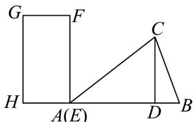
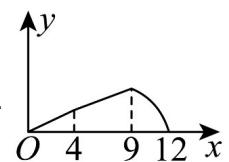
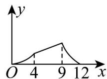
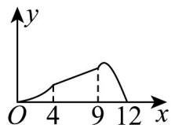
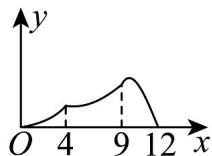

<!-- question-source:start -->
3. 如图，在VABC中， $CD \perp AB$ 于D，AD=9,DB=3,CD=6，矩形EFGH的顶点E与A点重合，

$EF = 8, EH = 4$ ，将矩形 $^{EFGH}$ 沿AB平移，当点E与点B重合时，停止平移，设点E平移的距离为x，矩形

$EFGH$ 与 VABC 重合部分的面积为 y，则 y 关于 x 的函数图象大致为（）

B

C

D

<!-- question-source:end -->

![[高中/课堂同步/题库/人教A版高中数学同步讲义(2026)/01_必修第一册/第三章 函数的概念与性质/专题3.4 函数的应用（一）（高效培优讲义）/强化训练/questions/answers/Q00074568A1.md]]
