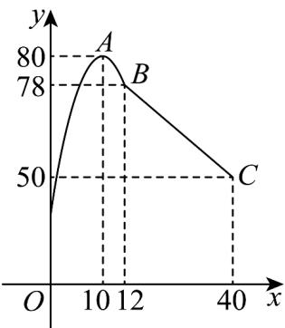

<!-- question-source:start -->
15. 某学校研究学习小组在对学生上课注意力集中情况的调查研究中发现，在 $^{40}$ 分钟的一节课中，注意力指数 y 与听课时间 x（单位：分）之间的关系满足如图所示的图象，当 $x \in [0,12]$ 时，图象是二次函数图象的一部分，其中顶点 $A(10,80)$ ，图象过点 $B(12,78)$ ；当 $x \in [12,40]$ 时，图象是线段 BC，其中 $C(40,50)$ ·根据专家研究，当注意力指数大于 $^{62}$ 时，学习效果最佳·要使得学生学习效果最佳，则教师安排核心内容的时间段为\_。

·(写成区间形式)

<!-- question-source:end -->

![[高中/课堂同步/题库/人教A版高中数学同步讲义(2026)/01_必修第一册/第三章 函数的概念与性质/专题3.4 函数的应用（一）（高效培优讲义）/强化训练/questions/answers/Q00074574A1.md]]
