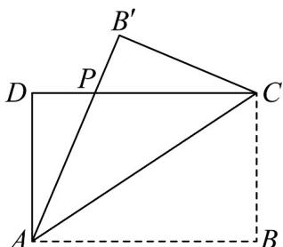

<!-- question-source:start -->
16. 设矩形 $ABCD(AB > CD)$ 的周长为 $20\mathrm{cm}$ ，其中 $AB = x$ ，现将 $\mathrm{VABC}$ 沿 $AC$ 向 $\triangle ADC$ 折叠至 $\mathrm{V}AB'C$ 的位

置，折过去后 $AB^{\prime}$ 交 $DC$ 于点 $P$

(1)设 $DP = m$ ，求 $m$ 关于 $x$ 的函数 $m = f(x)$ 的解析式及其定义域；

(2)求 $\triangle ADP$ 面积的最大值及相应 $x$ 的值.
<!-- question-source:end -->

![[高中/课堂同步/题库/人教A版高中数学同步讲义(2026)/01_必修第一册/第三章 函数的概念与性质/专题3.4 函数的应用（一）（高效培优讲义）/强化训练/questions/answers/Q00074575A1.md]]
