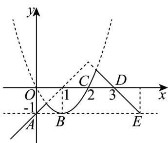

> [!faq]- 《专题3.4 函数的应用（一）（高效培优讲义）》官方解析
>
> > [!success]- **【答案】** B
>
> > [!note]- **【解析】**
> > 在平面直角坐标系中作出 $y = \min \left\{1 - |x - 2|, (x - 1)^2 - 1\right\}$ 的图象如图所示，
> >
> > 
> >
> > 令 $1 - |x - 2| = -1$ ，解得 $x = 0$ 或 $x = 4$ ，所以 $A(0, - 1), E(4, - 1)$
> >
> > 令 $(x-1)^{2}-1=-1$ ，解得x=1，所以 $B(1,-1)$ ，
> >
> > 由题可知，当 $y = \min\left\{1 - |x - 2|, (x - 1)^{2} - 1\right\}$ 在区间 $[m, n]$ 上的取值范围为 $[-1, 0]$ 时，
> >
> > 当且仅当 m=0, n=2 时 n-m 取得最大值，且最大值为 2-0=2
> >
> > 故选：B.
> >
> > 2. 长江流域水库群的修建和联合调度，极大地降低了洪涝灾害风险，发挥了重要的防洪减灾效益·每年洪水
> >
> > 来临之际，为保证防洪需要、降低防洪风险，水利部门需要在原有蓄水量的基础上联合调度，统一蓄水，用
> >
> > $= \frac{\text{该水库实际蓄水量}}{\text{该水库总蓄水量}} \times 100$ 蓄满指数（蓄满指数）来衡量每座水库的水位情况·假设某次联合调度要求如下：
> >
> > (i) 调度后每座水库的蓄满指数仍属于区间 $[0,100]$ ;
> >
> > (ii) 调度后每座水库的蓄满指数都不能降低；
> >
> > （iii）调度前后，各水库之间的蓄满指数排名不变·
> >
> > 记 $x$ 为调度前该水库的蓄满指数， $y$ 为调度后该水库的蓄满指数，给出下面四个 $y$ 关于 $x$ 的函数解析式：① $y = -\frac{1}{20} x^2 + 6x$ ；
> > - **②**：$y = \frac{1}{2} x + 50$ ；
> > - **③**：$y = |x - 1|$ ；
> > - **④**：$y = 10\sqrt{x}$ .
> >
> > 则满足此次联合调度要求的函数解析式的序号是（ ）A.②④ B.①④ C.②③ D.③④
> >
> > 【答案】A
> >
> > 【详解】函数 $y = -\frac{1}{20}x^{2} + 6x$ 的对称轴为 $x = -\frac{6}{2 \times \left(-\frac{1}{20}\right)} = 60$
> >
> > 所以 $y_{max} = -\frac{1}{20} \times 60^{2} + 6 \times 60 = 180$ ，超出了范围，不符合题意；
> >
> > $y=\frac{1}{2}x+50$ ， $x\in[0,100]$ 时， $y\in[50,100]$ ，
> >
> > 且 $y = \frac{1}{2} x + 50$ 在[0,100]上单调递增，
> >
> > $y - x = -\frac{1}{2}x + 50 \in [0, 50]$ ，即 y x，符合题意；
> >
> > 函数 $y = |x - 1|$ 在 $[0,1]$ 上单调递减，在 $[1,100]$ 上单调递增，故不符合题意；
> >
> > 函数 $y=10\sqrt{x}$ 为增函数，且 $x\in[0,100]$ 时， $y\in[50,100]$
> >
> > $0 \leq \sqrt{x} \leq 10$ ，则 $x \leq 10\sqrt{x}$ ，即 y x，符合题意。
> >
> > 故满足此次联合调度要求的函数解析式的序号是②④·
> >
> > 故选 **A**·
