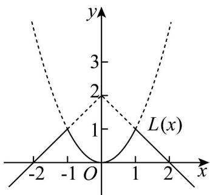
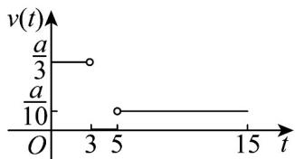
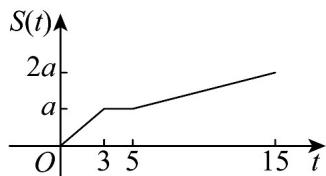
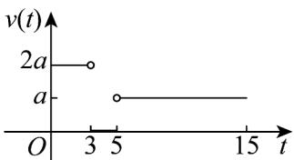
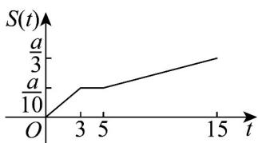

> [!faq]- 《专题3.4 函数的应用（一）（高效培优讲义）》官方解析
>
> > [!success]- **【答案】** B
>
> > [!note]- **【解析】**
> > 在同一直角坐标系中，画出函数 $f(x) = 2 - |x|$ ， $g(x) = x^2$ 的图象，
> >
> > 从而得函数 $L(x) = \begin{cases} f(x), f(x) \leq g(x) \\ g(x), f(x) > g(x) \end{cases}$ 图象，如图实线部分：
> >
> > 
> >
> > 对于 $^{A}$ ，因为函数 $L(x)$ 图象关于 y 轴对称，所以 $L(x)$ 是偶函数，正确；
> >
> > 对于 $^{B}$ ，根据零点的定义结合函数 $L(x)$ 的图象知，函数 $L(x)$ 有三个零点，分别为 $\pm2,0$ ，错误；
> >
> > 对于 C，从函数 $L(x)$ 图象观察得 $L(x)$ 在区间 $(-1,0)$ 上单调递减，正确；
> >
> > 对于 $^{D}$ ，从函数 $L(x)$ 图象观察得 $L(x)$ 有最大值，没有最小值，正确；
> >
> > 故选：B
> >
> > 6. 学校宿舍与办公室相距 $am$ ·某同学有重要材料要送交给老师，从宿舍出发，先匀速跑步 $3\mathrm{min}$ 来到办公室，停留 $2\mathrm{min}$ ，然后匀速步行 $10\mathrm{min}$ 返回宿舍·在这个过程中，这位同学行进的速度 $\nu(t)$ 和行走的路程 $S(t)$ 都是时间 $t$ 的函数，则速度函数和路程函数的示意图分别是下面四个图象中的（）
> >
> > 【答案】
> >
> > 
> > - **①**：
> > - **②**：
> > - **③**：
> > - **④**：A. ①② B. ③④ C. ①④ D. ②③
> >
> > 【答案】A
> >
> > 【详解】设行进的速度为 $v \, m/min$ ，行走的路程为 $S \, m$ ，
> > 则 $v = \begin{cases} \frac{a}{3}, 0 < t < 3 \\ 0, 3 \leq t \leq 5 \\ \frac{a}{10}, 5 < t \leq 15 \end{cases}$ ，且 $S = \begin{cases} \frac{a}{3}t, 0 < t < 3 \\ a, 3 \leq t \leq 5 \\ a + \frac{at}{10}, 5 < t \leq 15 \end{cases}$
> >
> > 由速度函数及路程函数的解析式可知，其图象分别为①②·
> >
> > 故选 **A**
