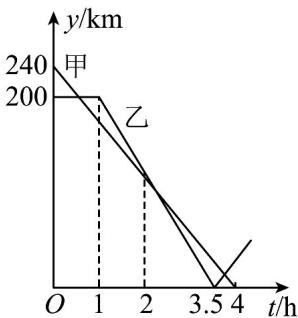

> [!faq]- 《专题3.4 函数的应用（一）（高效培优讲义）》官方解析
>
> > [!success]- **【答案】**  A. 甲车出发 $2h$ 时，两车相遇 B. 乙车出发 $1.5h$ 时，两车相距 $170km$ C. 乙车出发 $2\frac{5}{7}h$ 时，两车相遇 D. 甲车到达 $C$ 地时，两车相距 $40km$
>
> > [!note]- **【解析】**
> > 观察函数图象可知，当 $t=^{2}$ 时，两函数图象相交，
> >
> > ∵C地位于A、B两地之间，
> >
> > :交点代表了两车离 C 地的距离相等，并不是两车相遇，结论 A 错误；
> >
> > 甲车的速度为 $240 \div 4 = 60 (\mathrm{km} / \mathrm{h})$
> >
> > 乙车的速度为 $200 \div (3.5 - 1) = 80 \, (\text{km/h})$ ,
> >
> > $$
> > \because (2 4 0 + 2 0 0 - 6 0 - 1 7 0) \div (6 0 + 8 0) = 1. 5 (\mathrm{h}),
> > $$
> >
> > ∴乙车出发 1.5h 时，两车相距 170km，结论 B 正确；
> >
> > $$
> > \therefore (2 4 0 + 2 0 0 - 6 0) \div (6 0 + 8 0) = 2 \frac {5}{7} (\mathrm{h}),
> > $$
> >
> > $2\frac{5}{7}\mathrm{h}$ 乙车出发时，两车相遇，结论正确；
> >
> > $$
> > \because 8 0 \times (4 - 3. 5) = 4 0 (\mathrm{km}),
> > $$
> >
> > ∴甲车到达 C 地时，两车相距 $40 \, km$ ，结论 D 正确；
> >
> > 故选：BCD
> >
> > 12. 边际函数是经济学中一个基本概念，在国防、医学、环保和经济管理等许多领域都有十分广泛的应用，
> > 函数 $f(x)$ 的边际函数 $Mf(x)$ 定义为 $Mf(x)=f(x+1)-f(x)$ 某公司每月最多生产75台报警系统装置，生产 $x_{\text{台}}(x \in \mathbb{N}^{*})$ 的收入函数 $R(x) = 3000x - 20x^{2}$ （单位：元），其成本函数 $C(x) = 500x + 4000$ （单位：元），
> > 利润是收入与成本之差，设利润函数为 $P(x)$ ，则以下说法正确的是（）
> > A. $P(x)$ 取得最大值时每月产量为63台
> > B. 边际利润函数的表达式为 $MP(x) = 2480 - 40x (x \in \mathbb{N}^{*})$ C. 利润函数 $P(x)$ 与边际利润函数 $MP(x)$ 不具有相同的最大值
> > D. 边际利润函数 $MP(x)$ 说明随着产量的增加，每台利润与前一台利润差额在减少
> >
> > 【答案】BCD
> >
> > 【详解】对于 A 选项， $P(x)=R(x)-C(x)=-20x^{2}+2500x-4000$
> >
> > 二次函数 $P(x)$ 的图象开口向下，对称轴为直线 $x = \frac{2500}{40} = 62.5$
> >
> > 因为 $x \in \mathbb{N}^*$ ，所以， $P(x)$ 取得最大值时每月产量为63台或62台， $\mathsf{A}$ 错；
> >
> > 对于 B 选项， $MP(x)=P(x+1)-P(x)=\left[-20(x+1)^{2}+2500(x+1)-4000\right]-\left(-20x^{2}+2500x-4000\right)$
> >
> > $= 2480 - 40x(x\in \mathbf{N}^{*})$ ，B对；
> >
> > 对于 C 选项， $P(x)_{\max} = P(62) = P(63) = 74120$
> >
> > 因为函数 $MP(x) = 2480 - 40x$ 为减函数，则 $MP(x)_{\max} = MP(1) = 2440$ ，C对；
> >
> > 对于 D 选项，因为函数 $MP(x)=2480-40x$ 为减函数，
> >
> > 说明随着产量的增加，每台利润与前一台利润差额在减少， $^{D}$ 对·
> >
> > 故选：BCD.
> >
> > 13. 依法纳税是每个公民应尽的义务，个人取得的所得应依照《中华人民共和国个人所得税法》向国家缴纳
> >
> > 个人所得税（简称个税）.2019年1月1日起，个税税额根据应纳税所得额，税率和速算扣除数确定，计算公
> >
> > 式为：个税税额 = 应纳税所得额 × 税率 - 速算扣除数 · $^{①}$ 应纳税所得额的计算公式为：应纳税所得额 - 综合所得
> >
> > 收入额 $^{-}$ 基本减除费用 $^{-}$ 专项扣除 $^{-}$ 专项附加扣除 $^{-}$ 依法确定的其它扣除 $^{②}$ 其中，“基本减除费用”（免征颁）为
> >
> > 每年 60000 元，税率与速算扣除数见下表：
> >
> > <table><tr><td>级数</td><td>全年应纳税所得额所在区间</td><td>税率(%)</td><td>速算扣除数</td></tr><tr><td>1</td><td>[0,36000]</td><td>3</td><td>0</td></tr><tr><td>2</td><td>(36000,144000]</td><td>10</td><td>2520</td></tr><tr><td>3</td><td>(144000,300000]</td><td>20</td><td>16920</td></tr><tr><td>L</td><td>...</td><td>...</td><td>L</td></tr></table>
> >
> > 已知小华缴纳的专项扣除：基本养老保险，基本医疗保险费，失业保险等社会保险费和住房公积金占综合所
> >
> > 得收入额的比例分别是 $8\%, 2\%, 1\%, 9\%$ ，专项附加扣除是 $52800$ 元，依法确定的其它扣除是 $4560$ 元·设小华全
> >
> > 年应纳税所得额为 $t$ （不超过300000元）元，应缴纳个税税额为 $y$ 元，则 $y = f(t) =$ \_\_\_\_；如果小华
> >
> > 全年综合所得收入额为 220000 元，那么他全年应缴纳个税\_\_\_\_元·
> >
> > 【答案】
> >
> > $$
> > \left\{ \begin{array}{l} 0. 0 3 t, t \in [ 0, 3 6 0 0 0 ] \\ 0. 1 t - 2 5 2 0, t \in (3 6 0 0 0, 1 4 4 0 0 0 ] \\ 0. 2 t - 1 6 9 2 0, t \in (1 4 4 0 0 0, 3 0 0 0 0 0 ] \end{array} \right.
> > $$
> >
> > 3344
> >
> > 【详解】当 $t \in [0, 36000]$ 时， $f(t) = 0.03t$
> >
> > $$
> > \text {当} t \in \left(3 6 0 0 0, 1 4 4 0 0 0 \right] _ {\text {时}}, f (t) = 0. 1 t - 2 5 2 0
> > $$
> >
> > $$
> > \text {当} t \in (1 4 4 0 0 0, 3 0 0 0 0 0 ] _ {\text {时}}, f (t) = 0. 2 t - 1 6 9 2 0,
> > $$
> >
> > $$
> > \text {故} f (t) = \left\{ \begin{array}{l} 0. 0 3 t, t \in [ 0, 3 6 0 0 0 ] \\ 0. 1 t - 2 5 2 0, t \in (3 6 0 0 0, 1 4 4 0 0 0 ] \\ 0. 2 t - 1 6 9 2 0, t \in (1 4 4 0 0 0, 3 0 0 0 0 0 ] \end{array} ; \right.
> > $$
> >
> > 小华全年综合所得收入额为 220000 元时，应纳税所得额
> >
> > $$
> > t = 220000 - 220000 \times (8 \% + 2 \% + 1 \% + 9 \%) - 52800 - 60000 - 4560 = 58640
> > $$
> >
> > $$
> > t = 5 8 6 4 0 \in (3 6 0 0 0, 1 4 4 0 0 0 ] \text {, 故} f (t) = 0. 1 \times 5 8 6 4 0 - 2 5 2 0 = 3 3 4 4
> > $$
> >
> > 故他全年应缴纳个税 $^{3344}$ 元·
> >
> > 故答案为： $f(t)=\left\{\begin{aligned}&0.03t,t\in\left[0,36000\right]\\ &0.1t-2520,t\in\left(36000,144000\right]\\ &0.2t-16920,t\in\left(144000,300000\right]\end{aligned}\right.$ ；3344
